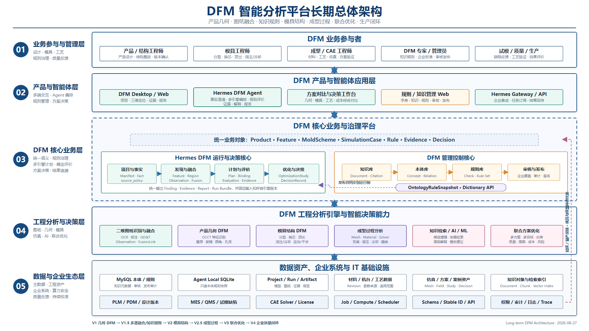

# DFM 智能分析平台产品规划与技术路线 🚀

## 1. 产品长期定位与当前研发阶段 🎯

DFM 智能分析平台的长期目标，是覆盖产品设计、模具设计、成型工艺和生产质量反馈的完整制造可行性
分析过程，为模具工程师提供统一的分析、判断、证据和整改闭环。

平台将逐步形成以下能力：

```text
三维产品几何分析
→ 二维图纸与三维模型融合
→ 企业知识、本体与规则治理
→ 模具结构可行性分析
→ 成型过程仿真与风险分析
→ 设计、模具和工艺方案联合优化
→ 试模及量产质量反馈闭环
```

当前研发处于技术底座建设和几何 DFM 生产化阶段，核心目标是：

> 上传 STEP → 识别结构区域 → 计算几何指标 → 执行工程规则 → 定位问题区域 →
> 生成证据和整改报告。

当前阶段重点建设的 Feature、Region、Metric、Check、RuleBinding、Evidence 等数据契约，不仅服务
几何规则核对，后续还会被二维融合、模具结构分析、成型仿真和方案优化继续复用。因此，几何 DFM
是整个产品长期发展的通用业务与数据底座。

## 2. DFM 产品能力全景 🧭

| 产品能力 | 主要解决的问题 | 核心技术 | 规划阶段 |
| --- | --- | --- | --- |
| 🗂️ 项目与分析数据底座 | 一次分析如何复现，结论如何追溯 | Manifest、Snapshot、Stable ID、Artifact、版本与哈希 | V0.9 |
| 🧱 产品几何 DFM | 壁厚、拔模、圆角、孔深、倒扣及结构比例是否合理 | OCCT C++、B-Rep 特征识别、区域化几何计算 | V1.0 |
| 📐 二维图纸与 2D/3D 融合 | 材料、公差、皮纹和技术要求如何与三维区域对应 | OCR、工程标注识别、Observation、FusionLink | V1.5 |
| 📚 知识、本体与规则治理 | 默认规则、企业规则和知识依据如何生成、审核和共享 | 知识检索、本体关系、规则 DSL、MySQL、发布快照 | V1.5 |
| 🧰 模具结构 DFM | 分型、侧向抽芯、顶出、浇注和冷却方案是否可行 | 模具结构语义、运动关系、空间可达性、方案评估 | V2.0 |
| 🌊 成型过程分析 | 充填、保压、冷却和翘曲风险如何评估 | 网格、材料流变数据、工艺边界、CAE Solver | V2.5 |
| 🧠 联合方案优化 | 产品、模具和工艺方案如何综合选择 | 多方案自动运行、多目标优化、约束求解 | V3.0 |
| 🏭 企业质量闭环 | 分析结果如何与试模、量产和企业经验持续闭环 | PLM/MES/QMS 集成、数据治理、效果校准 | V4.0 |

## 3. 产品长期总体架构 🏗️

下图面向产品长期规划，完整呈现从业务参与、智能体应用、核心业务治理、工程分析能力到企业数据
生态的总体架构，以及试模、质量和生产数据反哺规则与模型的闭环。

[](assets/dfm-system-long-term-architecture-ppt.svg)

汇报材料可直接使用：[SVG 矢量版](assets/dfm-system-long-term-architecture-ppt.svg) ·
[PNG 1920×1080 版](assets/dfm-system-long-term-architecture-ppt.png)

该图用于说明产品的长期目标架构，不替代当前版本的落地架构。当前版本架构及数据流继续保留在
[DFM 分析系统总体架构与数据流](dfm-system-architecture-and-data-flow.md)中。

## 4. 产品版本规划 🗺️

以下 `Vx.x` 是产品版本规划；现有研发文档中的 `M2.5/M2.6/M3` 等属于内部技术里程碑，两套编号
分别用于产品汇报和研发管理。

```mermaid
flowchart LR
    V09["V0.9<br/>技术与数据底座"] --> V10["V1.0<br/>几何 DFM 生产版"]
    V10 --> V15["V1.5<br/>多源融合与知识规则"]
    V15 --> V20["V2.0<br/>模具结构 DFM"]
    V20 --> V25["V2.5<br/>成型过程分析"]
    V25 --> V30["V3.0<br/>联合方案优化"]
    V30 --> V40["V4.0<br/>企业质量闭环"]

    classDef base fill:#eef4fb,stroke:#2f6fa5,color:#163a5c;
    classDef geometry fill:#eaf8f3,stroke:#2b8a78,color:#174f43;
    classDef mold fill:#fff3e5,stroke:#d8892b,color:#6a4213;
    classDef simulation fill:#f3f0ff,stroke:#7662a7,color:#40336a;
    classDef enterprise fill:#fff0f5,stroke:#b36183,color:#65243f;
    class V09 base;
    class V10,V15 geometry;
    class V20 mold;
    class V25,V30 simulation;
    class V40 enterprise;
```



### V0.9：技术与数据底座 🧪

**阶段目标**

建立可运行、可追溯、可扩展的 DFM 分析基础链路，冻结各代码工程之间的数据契约。

**核心交付**

- STEP 项目建档、事实确认、Discovery、AnalysisPlan、Run 和报告；
- 本体规则快照、本地 SQLite、规则表达式和确定性 Evaluation；
- PythonOCC 壁厚/拔模参考计算、证据图和报告；
- OCCT C++、二维识别、管理服务的跨项目接口契约。

**技术重难点 🔥**

- **全链路追溯**：输入、事实、特征、测量、规则、结论和证据必须形成稳定引用链；
- **数据契约稳定性**：不同代码仓库独立开发时，Schema、ID、版本和错误语义必须保持一致；
- **通用规则执行**：新增规则不能持续增加 Agent 专用业务分支；
- **结果可信边界**：参考算法、候选结果和生产认证结果必须有明确状态区分。

**阶段验收**

完整数据链可以重复运行；修改规则不改 Agent 代码即可生成新的评价结果；所有结果可以回链输入和版本。

---

### V1.0：几何 DFM 生产版 🧱

**阶段目标**

形成模具工程师可实际使用的塑胶产品几何 DFM 分析能力。

**核心交付**

- 独立 `dfm-occt-worker`，使用 OCCT C++ 完成生产级 STEP 处理；
- 识别主壁、螺钉柱、加强筋、凸台、孔、倒扣和外观面等结构区域；
- 计算壁厚、拔模角、圆角、孔深、距离和比例等指标；
- MySQL 本体库、规则库、默认规则、企业规则、审核和发布；
- 问题区域三维定位、证据图、规则依据和 DFM 报告。

**技术重难点 🔥**

- **B-Rep 特征语义识别**：CAD 面只有几何和拓扑信息，需要推断螺钉柱、筋和主壁等业务语义；
- **壁厚与局部指标精度**：复杂曲面、圆角、薄壁、开口和内部结构容易造成错误配对或漏算；
- **拓扑身份稳定**：加载、修复和网格化后的区域必须准确对应原始 CAD 实体；
- **坏模型与大模型处理**：容差、Healing、超时、内存和多任务并发需要统一控制；
- **工程 Ground Truth**：必须用真实产品建立特征、测量、问题区域和规则结论的验收基准。

**阶段验收**

在批准产品范围内，特征识别、指标计算和问题区域达到工程师认可的准确率，并通过并发及稳定性测试。

---

### V1.5：多源融合与知识规则平台 📐📚

**阶段目标**

把三维模型、二维图纸、用户信息、企业知识和工程规则统一到同一分析项目中。

**核心交付**

- PDF/图片图纸解析、OCR、尺寸、公差、GD&T、材料、皮纹和技术要求识别；
- 二维 Observation 与三维 Feature/Region 的可审核 FusionLink；
- `source_policy` 管理用户、项目属性、图纸识别和几何识别等事实来源；
- 知识文档、Revision、Chunk、Citation 和受控检索；
- AI 根据本体和知识引用起草规则，由工程师审核并发布企业规则包。

**技术重难点 🔥**

- **二维工程语义理解**：需要识别文字、尺寸线、引线、符号、视图和局部结构之间的关系；
- **2D/3D 空间对应**：主视图、剖视图、局部放大和投影方向需要映射到三维区域；
- **多来源事实冲突**：用户、图纸、PLM 和识别结果不一致时，需要保留证据并进入确认流程；
- **企业规则继承**：系统默认、企业和客户规则需要展开、冲突检测、审核、版本固定和回滚；
- **AI 生成可控性**：AI 只能使用已声明本体、Operand、Factor、DSL 和 Citation，不得自行创造阈值。

**阶段验收**

二维信息能够稳定参与三维规则分析；企业规则更新无需发布 Agent 新版本；所有事实和规则具有来源依据。

---

### V2.0：模具结构 DFM 🧰

**阶段目标**

从“产品结构是否合理”扩展到“模具结构方案是否可实现、可制造、可运动和可维护”。

**核心交付**

- 分型方向、分型区域和型芯/型腔候选；
- 倒扣对应的滑块、斜顶和侧向抽芯候选；
- 顶出区域、顶针布置约束和脱模可达性分析；
- 浇口、流道和冷却区域的候选方案与几何约束；
- 模具结构方案的规则检查、干涉检查、证据和人工确认流程。

**技术重难点 🔥**

- **从产品语义推导模具语义**：同一个产品可能存在多种合法分型和抽芯方案，不是单一识别问题；
- **运动与空间可达性**：滑块、斜顶、顶针和开模动作需要方向、行程、干涉和装配空间分析；
- **方案组合爆炸**：多个倒扣、分型和顶出候选会形成大量组合，需要约束求解和排序；
- **设计意图与企业习惯**：标准模架、加工能力、寿命、成本和维护策略会改变方案选择；
- **人机协同确认**：系统应提出可解释候选方案，关键模具结构仍由工程师最终确认。

**阶段验收**

对限定产品类型，系统可以输出可解释的模具结构候选、冲突位置和方案约束，并支持工程师复核与修正。

---

### V2.5：成型过程分析 🌊

**阶段目标**

建立充填、保压、冷却和翘曲等成型过程分析能力，为产品与模具方案提供过程验证。

**核心交付**

- 独立 `dfm-simulation-worker` 和统一 Simulation Case；
- 产品、浇口、流道、材料 Revision、机台和工艺条件管理；
- 网格生成、质量检查以及 CAE Solver 适配；
- 充填时间、压力、温度、剪切、锁模力、熔接线、气穴、缩痕和翘曲结果；
- 仿真场与三维 Feature/Region、规则、证据和报告统一关联；
- 仿真任务排队、并发、取消、超时、许可和算力资源管理。

**技术重难点 🔥**

- **网格质量**：复杂薄壁、微小特征、坏几何和尺度差异会直接影响求解稳定性和精度；
- **材料流变数据**：黏度、PVT、热性能和材料牌号版本决定结果可信度；
- **边界条件完整性**：浇口、流道、温度、速度、压力、保压和冷却设置必须有来源且可复现；
- **求解稳定性与计算成本**：收敛、并行、超大模型、许可数量和任务调度形成新的计算技术栈；
- **工程精度认证**：关键结果必须与基准 CAE、试模数据和量产缺陷建立误差标准。

**阶段验收**

在批准材料、产品和工艺范围内，关键场结果达到工程验收误差，并可完整回链网格、材料、参数和 Solver 版本。

---

### V3.0：产品、模具与工艺联合优化 🧠

**阶段目标**

从单次问题检查升级为多方案对比和综合决策，支持产品结构、模具方案和成型工艺协同优化。

**核心交付**

- 产品几何修改前后的 DFM 与成型影响比较；
- 分型、抽芯、浇口、流道和冷却方案的多方案对比；
- 料温、模温、速度、压力和保压等工艺窗口分析；
- 多个 Simulation Case 自动生成、执行、评分和排序；
- 质量、周期、成本、模具复杂度和风险的综合评价；
- 带依据的优化建议、方案差异和工程审批记录。

**技术重难点 🔥**

- **多目标冲突**：质量、周期、成本、压力、熔接线和翘曲通常无法同时最优；
- **搜索空间规模**：几何、模具和工艺参数组合会产生大量候选方案；
- **跨引擎结果统一**：几何规则、模具约束、CAE 场和企业经验需要统一量纲和评分口径；
- **自动修改的安全边界**：系统可以提出参数化修改或候选方案，但不能直接破坏设计意图；
- **计算资源复用**：需要识别哪些变化只重做规则评价，哪些变化必须重新网格和求解。

**阶段验收**

工程师可以在同一项目中比较多个可复现方案，清楚看到质量、周期、成本和风险之间的取舍。

---

### V4.0：企业质量闭环与多工艺平台 🏭

**阶段目标**

将设计分析、模具开发、试模和量产质量数据形成企业数字主线，并把通用平台扩展到更多制造工艺。

**核心交付**

- 与 PLM、MES、QMS、试模和缺陷系统连接；
- 设计版本、DFM 结论、仿真结果、试模参数和量产缺陷关联；
- 企业材料库、机台库、模具方案库和历史案例库；
- 用真实生产结果校准风险模型、规则和仿真参数；
- 注塑之外的压铸等工艺通过独立 Process、Capability 和规则 Scope 接入；
- 企业级权限、审计、数据隔离、模型版本和效果监控。

**技术重难点 🔥**

- **企业数据治理**：历史项目命名、缺陷分类、工艺记录和模型版本需要统一；
- **跨系统数字主线**：设计、分析、模具、试模和量产对象必须使用稳定身份关联；
- **规则与模型校准**：真实生产反馈需要区分相关性、因果性和适用范围；
- **跨企业数据隔离**：企业规则、客户模型、材料数据和缺陷数据均属于敏感资产；
- **多工艺扩展**：不同工艺必须拥有独立语义、算法能力和认证范围，不能复制注塑规则。

**阶段验收**

能够用真实项目数据衡量分析准确率、试模轮次、返工率和开发周期，并持续优化企业规则与模型。

## 5. 分阶段技术重难点矩阵 🔥

| 版本 | 最关键的技术问题 | 难点本质 | 主要验证方式 |
| --- | --- | --- | --- |
| V0.9 | 数据契约与全链路追溯 | 多仓库、多版本对象必须准确关联 | Schema 负例、重放、Hash 和跨版本测试 |
| V1.0 | B-Rep 特征识别与指标精度 | 从几何拓扑推断工程语义并稳定计算 | Golden Model、真实产品、工程师标注 |
| V1.5 | 2D/3D 融合与规则治理 | 多模态语义对应和企业规则继承冲突 | 图纸标注集、Fusion 审核集、规则发布回归 |
| V2.0 | 模具结构方案推导 | 一个产品存在多个受约束可行方案 | 模具方案案例库、运动/干涉测试、专家评审 |
| V2.5 | 网格、材料、边界和求解精度 | 输入质量和 CAE 参数共同决定结果可信度 | 基准 Solver、试模和量产数据对比 |
| V3.0 | 多目标方案优化 | 搜索空间大且质量、周期和成本目标冲突 | 多方案盲测、Pareto 结果和工程选型复核 |
| V4.0 | 企业数据闭环与持续校准 | 数据跨系统、跨版本且质量不稳定 | 数字主线审计、线上效果监控、业务指标 |

## 6. 技术架构演进 🏗️

产品长期演进保持“智能体编排、几何计算、过程仿真、规则治理”相互解耦：

| 模块 | 长期职责 | 主要演进阶段 |
| --- | --- | --- |
| `hermes-agent` | 项目与事实、任务编排、计划、规则评价、证据、报告和多端交互 | 全阶段持续演进 |
| DFM 管理 Web + Django/MySQL | 知识、本体、默认/企业规则、审核、发布、审计和字典共享 | V1.0—V1.5 |
| `dfm-occt-worker` | STEP、B-Rep、产品及模具特征、几何指标、运动/干涉和定位 Artifact | V1.0—V2.0 |
| 二维识别与 Fusion | 图纸 Observation、事实候选和 2D/3D 可审核关系 | V1.5 |
| `dfm-simulation-worker` | 网格、材料/工艺边界、成型求解、仿真场和 Solver 适配 | V2.5 起 |
| 优化与方案服务 | 多方案生成、自动执行、多目标评分和方案比较 | V3.0 起 |
| 企业数据连接层 | PLM/MES/QMS、试模、缺陷和质量反馈 | V4.0 起 |

模流与其它成型仿真作为独立 Simulation Worker 接入，不与 Hermes Agent Loop 或 OCCT 几何内核耦合。
Hermes 继续复用统一的项目、事实、规则、Evidence、Finding 和报告机制。

核心数据链随版本逐步扩展：

```text
Input / Fact / OntologyRuleSnapshot
→ Feature / Region / Measurement
→ MoldScheme / MotionConstraint
→ SimulationCase / MeshSnapshot / SolverRun / SimulationField
→ Evaluation / Evidence / Finding
→ OptimizationStudy / DecisionRecord
→ Trial / ProductionFeedback / CalibrationRecord
```

## 7. 研发能力与资源重点 👥

| 阶段 | 核心专业能力 | 关键协作角色 |
| --- | --- | --- |
| V0.9—V1.0 | OCCT C++、计算几何、规则执行、工程验证 | 几何算法工程师、DFM/模具工程师、Agent 后端工程师 |
| V1.5 | 文档智能、2D/3D 几何、知识检索、规则治理 | OCR/视觉工程师、知识平台工程师、规则专家 |
| V2.0 | 模具结构、运动机构、空间约束和方案设计 | 资深模具设计工程师、几何/约束算法工程师 |
| V2.5 | CAE 网格、材料流变、注塑工艺和数值求解 | 模流/CAE 工程师、求解器集成工程师、计算平台工程师 |
| V3.0 | 多目标优化、参数化设计和大规模任务调度 | 优化算法工程师、产品/模具/成型工艺专家 |
| V4.0 | 企业数据治理、系统集成、模型监控和安全 | 数据工程师、集成工程师、MLOps、安全与业务负责人 |

## 8. 总体推进原则 ⚖️

1. **每个版本形成独立业务价值。** 不等待全部能力完成后一次性交付。
2. **当前底座持续复用。** Feature、Region、Metric、Check、Fact、Evidence 和 Snapshot 保持稳定演进。
3. **算法能力必须经过工程认证。** 候选、参考结果和生产结论具有明确可信等级。
4. **规则、几何和仿真结果分工清晰。** OCCT 计算几何，Solver 计算过程场，程序执行规则，AI 负责交互和解释。
5. **复杂方案保留人工确认。** 分型、抽芯、浇口、冷却和优化方案由系统生成候选，工程师完成最终决策。
6. **真实数据逐阶段积累。** 每个版本同步建设 Golden Set、案例库和评价指标，为下一阶段提供可靠数据基础。
7. **产品价值可度量。** 重点跟踪问题检出率、误报率、分析时间、试模轮次、返工率和开发周期。
