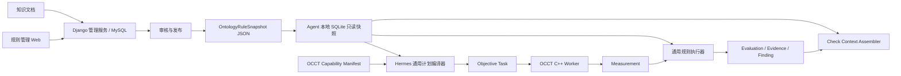

# DFM 本体、规则库与 Agent 运行快照设计

## 1. 设计目标

本设计只解决三类需要跨代码仓库、跨端共享并独立发布的问题：

1. 用稳定 ID 描述 DFM 的 Process、Feature Type、Geometric、Check 和 Factor；
2. 生成、审核、发布系统默认规则和企业规则；
3. 将当前企业可执行的本体与规则编译成 Agent 可离线使用的只读快照。

本体库不是几何算法数据库。OCCT 如何识别螺钉柱、如何计算壁厚、拔模角和圆角，仍由
`dfm-occt-worker` 的 C++ 实现和 Capability Manifest 负责。数据库只描述这些能力的业务语义、
组合关系和规则。

`V2.2.xlsx` 是不可修改的人工业务权威来源；导入器只读取其中明确存在的 ID、名称、关系和规则，
数据库模型与运行快照不反向修改该工作簿。

## 2. 为什么这些数据需要落库

一个概念只有在至少满足下列一项时才进入本体/规则库：

- 需要由管理后台新增、修改、审核或停用；
- 需要系统默认、企业或客户不同版本；
- 需要 Web、Desktop、Agent 和 OCCT 使用统一稳定 ID；
- 需要在生成规则时明确提供给 AI；
- 需要版本追溯、引用来源或重放历史分析。

否则应留在代码中。例如壁厚射线算法、Shape Healing 策略和孔深计算实现不进入数据库。

仅把表建出来不会让 AI 自动理解本体。管理服务和 Agent 必须按 Check 组装有限上下文，明确提供
概念、关系、可用 Operand、Factor、规则和知识引用。

## 3. 三层数据架构



| 层级 | 数据源 | 职责 |
| --- | --- | --- |
| 算法能力层 | OCCT C++ 代码和 Capability Manifest | Recognizer、Calculator、Metric/Quantity、参数和认证状态 |
| 管理控制层 | Django/MySQL 8.0+ | 本体维护、规则生成、审核、默认/企业覆盖、知识引用和发布 |
| Agent 运行层 | 本地 SQLite 快照 | 只读查询、Check 上下文、计划编译、规则选择和离线复现 |

管理库和 Agent 本地库不是同一个数据库。管理库支持编辑和继承；本地库是一次发布后展开、校验、
不可变的运行投影。

管理控制层现已在独立的 Mold 仓库实现；Agent 可将 Snapshot Schema 2/3 发布包安装为本地 SQLite，
随仓库提供的默认发布包仍为 Schema 2。
两端按本文的 Geometric/Operand 契约对接；数据库迁移、工作簿导入、认证 Capability 和签名校验
是否已启用，仍须按实际部署环境逐项验证，不能由本地测试代替上线验收。

多端不直接连接 MySQL，通过管理服务共享字典：

```text
GET /v1/dfm/dictionary?ontology_version=...
GET /v1/dfm/checks/{check_id}/context
GET /v1/dfm/publications/latest?process=...&organization_id=...
GET /v1/dfm/publications/{snapshot_id}/artifact
```

Web 使用字典/Context API，Agent 下载签名发布物，OCCT 只交换 Capability 和几何任务契约。

中心管理库固定采用 MySQL 8.0+、InnoDB 和 `utf8mb4`。Django `UUIDField` 在 MySQL 中按
`char(32)` 落库，所有时间使用 UTC `datetime(6)`；`JSONField` 映射为 MySQL `json`。高频过滤条件
必须使用普通关系字段或生成列索引，不依赖对任意 JSON 路径做全表扫描。知识向量检索不与本体/规则
关系表耦合，需要时使用独立检索服务。

## 4. 中心管理库表

使用 9 张核心表。严重度属于 Rule Version 的语义内容，不为分级口径增设管理表；
企业或客户的差异由其规则版本和 Rule Set 作用域表达。不建立完整 RDF/OWL 系统，
也不为 Excel 的一级、二级、三级标题建表。

### 4.1 `dfm_concept`

所有跨端共享的稳定业务概念。

| 字段 | 类型 | 说明 |
| --- | --- | --- |
| `id` | char(32) PK | UUID 数据库主键，由 Django `UUIDField` 映射 |
| `concept_id` | varchar(180) UNIQUE | 稳定 ID，如 `check.main_wall_minimum_thickness` |
| `concept_type` | varchar(30) | `process/feature_type/geometric/check/factor` |
| `name_zh` | varchar(180) | 中文显示名 |
| `name_en` | varchar(180) nullable | 英文显示名 |
| `definition` | text | 无阈值的准确工程定义 |
| `aliases_json` | json | 同义词和旧名称 |
| `data_schema_json` | json nullable | Factor 值或 Geometric 值的 JSON Schema |
| `properties_json` | json | 不同 Concept Type 的受控扩展属性 |
| `owner_organization_id` | char(32) nullable | 空为系统概念，非空为企业扩展 |
| `status` | varchar(20) | `draft/active/retired` |
| `created_by_id` | char(32) | 创建人 |
| `updated_at` | datetime(6) | UTC 更新时间 |

`properties_json` 的常用字段：

| Concept Type | 字段 |
| --- | --- |
| Process | 无，保存为空对象 `{}` |
| Feature Type | `worker_kind` |
| Geometric | `worker_geometric_id/quantity_id/dimension/canonical_unit` |
| Factor | `runtime_key/default_value/question/source_policy` |
| Check | `report_group`；历史 `default_severity` 仅作 Draft 起草提示，不作为运行时定级来源 |

以上是 `properties_json` 的完整字段白名单。字段有可靠来源时填写实际内容，没有来源时保留空字符串、
`null` 或空对象；除此之外的来源追踪、显示分组、导入版本和关系缓存等字段不写入
`properties_json`。Excel 来源追踪由 Rule Citation、导入日志和发布物哈希承担。
白名单内字段均在规则库管理界面完整展示，但只读，包括 Feature Type 的 `worker_kind`、Geometric 的
`worker_geometric_id/quantity_id/dimension/canonical_unit` 和 Factor 的 `runtime_key`。这些字段仅由
工作簿导入或能力同步流程维护；普通管理 API 不接受改写，发布时再依据认证 Capability 和规则完整性要求校验这些值。

`concept_id` 发布后不得改名；改显示名称或定义不改变稳定 ID。确实发生语义不兼容时创建新 ID，旧 ID
进入 `retired`。

Check 的 `default_severity` 不得自动填入 Rule Version，也不得在规则未定级时充当发布或评估回退值；
新规则的权威严重度由工程师在具体 Rule Version 上审核确定。历史快照保留该属性供兼容读取，
新建 Check 不要求填写，待历史数据完成迁移后废弃。

#### Factor 的 `source_policy`

`source_policy` 保存于 `concept_type=factor` 的 `dfm_concept.properties_json`，用于声明影响因子的允许
来源和采信策略。它不保存项目中的实际值；实际值仍保存为 Agent 项目 Manifest 中的 `FactRecord`，
候选识别结果保存为 `ObservationRecord`。

```json
{
  "runtime_key": "surface_texture",
  "question": "产品表面采用什么皮纹？",
  "source_policy": {
    "allowed_sources": [
      "USR",
      "DWG",
      "CAD",
      "GEO",
      "DOC",
      "DB",
      "DER",
      "DEF"
    ],
    "auto_accept_sources": ["CAD", "DOC", "DB", "DER", "DEF"],
    "confirmation_required_sources": [
      "DWG",
      "GEO"
    ],
    "min_confidence": 0.9,
    "evidence_required": true,
    "conflict_policy": "ask_user",
    "missing_policy": "ask_user"
  }
}
```

字段约束：

| 字段 | 类型 | 说明 |
| --- | --- | --- |
| `allowed_sources` | string[] | 该 Factor 允许使用的来源白名单 |
| `auto_accept_sources` | string[] | 满足数据 Schema、置信度和证据要求后可自动转为 confirmed Fact 的来源 |
| `confirmation_required_sources` | string[] | 只能先形成 Observation，必须经用户或工程师确认的来源 |
| `min_confidence` | number nullable | 识别类来源进入确认流程的最低置信度，范围 `0..1` |
| `evidence_required` | boolean | 非用户来源是否必须保存 `evidence_refs` |
| `conflict_policy` | string | 多来源值冲突时的策略；第一期固定支持 `ask_user` |
| `missing_policy` | string | 所有允许来源均无有效值时的策略；第一期固定支持 `ask_user` |

来源码直接沿用 `V2.2.xlsx` 的“取值来源”代码，导入和发布过程中不得改名、合并或派生为其他来源码：

| 来源码 | 含义 |
| --- | --- |
| `USR` | User Input，用户明确输入或确认 |
| `DWG` | Drawing，二维图纸及其识别结果 |
| `CAD` | CAD Model / PMI，CAD 模型或 PMI 数据 |
| `GEO` | Geometry，STEP/OCCT 几何识别或计算结果 |
| `DOC` | Document，规范、说明书等文档内容 |
| `DB` | Database，材料库等结构化数据库数据 |
| `DER` | Derived / Derivation，程序基于已确认事实进行的确定性推导 |
| `DEF` | Default，规则库明确给出的默认值 |

`auto_accept_sources` 和 `confirmation_required_sources` 必须都是 `allowed_sources` 的子集，且不能重叠。
识别结果先保存为带来源、置信度和证据的 Observation；只有通过 `source_policy` 后才能成为参与规则匹配
的 confirmed Fact。规则条件默认只使用规范化后的 Factor 值，不因来源不同而改变工程阈值。

几何连续量不应为了复用该机制而转成 Factor。例如螺钉柱壁厚、高度和直径属于
`Measurement/Operand`；“识别出螺钉柱”属于 `Feature`；材料、皮纹和外观等级等用于选择工程规则的
上下文才属于 `Factor/Fact`。

### 4.2 `dfm_relation`

保存本体关系，也是 Agent 通用编译和 AI 上下文的核心。

| 字段 | 类型 | 说明 |
| --- | --- | --- |
| `id` | char(32) PK | UUID 主键 |
| `relation_id` | varchar(220) UNIQUE | 稳定关系 ID |
| `subject_concept_id` | char(32) FK | 主语 Concept |
| `predicate` | varchar(40) | 受控谓词 |
| `object_concept_id` | char(32) FK | 宾语 Concept |
| `qualifiers_json` | json | 关系的可执行限定信息 |
| `sort_order` | integer | Operand、询问和显示顺序 |
| `status` | varchar(20) | `draft/active/retired` |

第一期谓词：

| Predicate | 示例 | 是否参与执行 |
| --- | --- | --- |
| `HAS_CHECK` | Process → Check | 是 |
| `APPLIES_TO_FEATURE` | Check → Feature Type | 是 |
| `USES_OPERAND` | Check → Geometric | 是 |
| `REQUIRES_FACTOR` | Process/Check → Factor | 是 |
| `AFFECTS` | Factor/Feature → Check | AI解释和检索 |
| `RELATED_TO` | 任意 Concept → Concept | AI解释和检索 |

`USES_OPERAND.qualifiers_json`：

```json
{
  "alias": "boss_wall_thickness",
  "aggregation": "minimum",
  "required": true,
  "operand_text": "螺钉柱柱壁实际壁厚 t"
}
```

Geometric 的 `worker_geometric_id/quantity_id` 来自 Geometric Concept，Feature 的 `worker_kind` 来自
`APPLIES_TO_FEATURE` 指向的 Feature Concept。`operand_text` 直接保存规则来源中的“比较对象”字符串，
不再为字符串中出现的区域另建 Region Type Concept。

```text
Check ──APPLIES_TO_FEATURE──> Feature
  └─────USES_OPERAND────────> Geometric
               └────────────> qualifiers.operand_text
```

发布器保证每个 Operand alias 唯一、`operand_text` 非空且关联 Geometric/Feature 有效。Hermes 在编译
AnalysisPlan 时结合 Operand 原文、Discovery 结果和经过认证的 Capability 完成几何目标解析；Django
不生成 `REGION_SRC_*`、`worker_role` 或其他无法回溯到规则来源的区域标识。

`REQUIRES_FACTOR.qualifiers_json`：

```json
{
  "usage_role": "rule_selector",
  "required": true,
  "missing_policy": "ask_user",
  "phase": "analysis",
  "question": "使用什么材料牌号？",
  "required_by": ["C_SCREW_BOSS_DRAFT"]
}
```

### 4.3 `dfm_factor_option`

只保存枚举型 Factor 的系统或企业选项。

| 字段 | 类型 | 说明 |
| --- | --- | --- |
| `id` | char(32) PK | UUID 主键 |
| `factor_concept_id` | char(32) FK | 必须指向 `concept_type=factor` |
| `organization_id` | char(32) nullable | 空为系统选项 |
| `option_code` | varchar(100) | 稳定选项码，如 `ABS` |
| `name_zh` | varchar(160) | 显示名称 |
| `value_json` | json | 实际规范值 |
| `sort_order` | integer | 排序 |
| `status` | varchar(20) | `active/retired` |

唯一约束按系统/企业作用域实现。Excel 的三级分类只用于导入解析，不写入 Concept 的
`properties_json`，也不参与规则匹配。

### 4.4 `dfm_rule_version`

一行保存一条完整、不可变的规则版本。一条 Rule Version 对一个 Check 定义一组必须同时成立的合格判定，
不按技术指标拆成多条规则或新增 `rule_condition` 表；Agent 按 Check 获取候选规则，管理后台以完整决策行
编辑和审核。

| 字段 | 类型 | 说明 |
| --- | --- | --- |
| `id` | char(32) PK | UUID `rule_version_id` |
| `rule_id` | varchar(180) | 稳定规则身份 |
| `version` | varchar(32) | 规则版本 |
| `check_concept_id` | char(32) FK | 对应 Check |
| `owner_organization_id` | char(32) nullable | 空为系统规则，非空为企业创建规则；实际生效范围仍由 Rule Set 决定 |
| `name` | varchar(180) | 规则名称 |
| `conditions_json` | json | 规则适用条件数组，仅使用已确认的 Factor/Fact，全部 AND；不表示 Check 的合格判定 |
| `acceptance_criteria_json` | json | 非空合格判定项数组，全部 AND；每项包含 `criterion_id/expression/comparator/threshold/result_unit` |
| `severity` | varchar(20) nullable | 规则失效后果的严重度代码：`critical/high/medium/low`；Draft 可暂空，审核通过前必填；无 `warning` 默认值 |
| `severity_rationale` | text nullable | 针对本规则及适用条件的定级理由；Draft 可暂空，审核通过前必填 |
| `recommendation_template` | text nullable | 工程建议模板 |
| `explanation_text` | text nullable | 人可读说明 |
| `priority` | integer | 同作用域优先级 |
| `is_default` | boolean | 无专用变体时的默认规则 |
| `status` | varchar(20) | `draft/review/approved/released/retired` |
| `generated_by_ai` | boolean | 是否由 AI 起草 |
| `content_sha256` | char(64) | 不可变内容哈希 |
| `created_by_id` | char(32) | 创建人 |
| `reviewed_by_id` | char(32) nullable | 审核人 |
| `reviewed_at` | datetime(6) nullable | UTC 审核时间 |

`owner_organization_id` 表示规则归属，实际企业/客户生效范围仍由 Rule Set 决定；
`created_by_id` 和 `reviewed_by_id` 只记录人员审计身份，不代表“仅对该个人生效”的规则作用域。

`conditions_json` 仅用于判断规则是否适用，例如
`{ "factor_id": "F_PROC_BASE", "operator": "EQ", "value": "热塑性注塑" }`。它不能包含 Geometric
的合格阈值，也不能因为某项技术指标不合格而跳过该规则或回退到默认规则。本版新规则只用 Factor/Fact
筛选适用的 Rule Version；若今后确需按孔径等几何量选择不同规格，须单独定义明确的几何适用条件契约，
与合格判定项严格区分，不把它伪装成 Factor。

`acceptance_criteria_json` 中每个 `criterion_id` 在一条 Rule Version 内唯一，用于结果和证据追踪；
`expression` 可引用同一 Check 的多个 `USES_OPERAND.qualifiers.alias` 并使用受控算术运算；
`comparator` 为 `GT/GTE/LT/LTE/EQ/NE/BETWEEN`；`threshold` 为常量、上下限或发布前已编译的
查表结果；`result_unit` 是表达式结果和阈值的共同单位。一个 Operand 可以在多个判定项中复用，
测量只做一次。判定项数组隐含 AND，不引入任意布尔脚本或 OR；确有 OR 业务需求时再扩展受控契约。
所有判定项通过才算 Check 通过；任一有效判定项失败则 Check 失败，并继续记录其他项的结果。
若尚无失败项但存在缺失或无效 Measurement，Check 为无法判定，不能当作通过，也不得因此
换选另一条规则；已取得的测量与判定结果仍须保留。
`conditions_json` 和 `acceptance_criteria_json` 均属于规则语义内容，纳入 `content_sha256`；
改变适用条件、任一判定表达式或阈值时，必须创建新的 Rule Version。

唯一约束：`UNIQUE(rule_id, version)`。

管理端新建 Rule Version 时，版本号由系统生成且不可手工修改。新的 `rule_id` 从 `V1.0.0`
开始；输入已有 `rule_id` 时，以该规则族最高版本的内容作为新版本初始值，并将补丁位递增一位。
所有新建版本统一使用 `Vx.x.x` 三段格式，且必须严格高于该 `rule_id` 的现有最高版本。
`name` 由 Check 中文名与 Rule ID 组合生成（`{check.name_zh}－{rule_id}`），不作为独立人工输入。
从已有 Rule ID 复制后，若规则内容与最高版本完全相同，则不得保存仅版本号不同的空版本。

`severity` 描述该规则未满足时的**后果严重度**，不是对本次测量超限幅度的自动评分，
也不是 FMEA 意义上的风险/行动优先级。`priority` 只用于规则选择，不用于风险排序。
同一 Check 在不同材料或功能适用条件下若后果不同，应通过不同 Rule Version 和
`conditions_json` 表达；不得由 HTML 报告临时推断或升级严重度。
`severity_rationale` 应说明失效模式、受影响功能/制造过程、适用前提和定级依据；
若依据来自标准、客户要求或知识文档，同时关联 `dfm_rule_citation`，不以一句通用描述代替工程评审。
`severity` 和 `severity_rationale` 均属于规则语义内容，纳入 `content_sha256`，
随 Rule Version 冻结。定级口径调整后，需要重新评审的规则创建新 Rule Version；
未重新评审的旧版本保留原等级和定级理由，不得直接改写，也不得在报告中按新口径重新解释。
从旧版本复制或工作簿批量导入的等级只能作为 Draft 待确认值；审批人必须逐条确认等级与理由，
不得因 Check 默认值、导入器默认值或上一版本已有等级而跳过工程评审。

生命周期允许 `draft → review → approved/released → retired`，审核退回使用 `review → draft`。
为撤销误操作，`retired` 可恢复为 `approved`；恢复操作不得修改规则内容、审核人、审核时间或
`content_sha256`，也不得直接恢复为可编辑的 `draft`。

#### 严重度分级口径（草案，待工程审核）

| 代码 | 后果判定边界 | 报告汇总 |
| --- | --- | --- |
| `critical` | 有明确依据表明涉及安全、法规、核心功能失效或不可制造，必须升级工程决策 | 高 |
| `high` | 重大功能、质量或制造后果，通常需显著设计/模具修改 | 高 |
| `medium` | 明确不满足要求，需工程整改或书面评审，但尚无重大后果证据 | 中 |
| `low` | 局部非关键质量或工艺优化，预期后果较轻 | 低 |

这是项目内的后果严重度口径草案，不代表现有规则已经完成定级。`critical` 不因超限比例大而自动成立；
同理，轻微超限也不能自动降为 `low`。是否阻断放行属于独立处置策略，不从 `severity` 暗推。
若今后需要结合发生可能性、探测能力或项目证据计算动态风险，应另建受控的风险评估契约，
不能复用本字段冒充完整风险评分。

口径定义保留在本设计文档中，不复制到每条规则，也不在数据库中另建表；
定级理由必须针对具体规则及适用条件填写。口径变动应先经过工程审核，再逐条评审受影响规则，
需要调整等级或理由的创建新 Rule Version，不单独维护口径版本字段。
系统、企业和客户共用相同的等级定义，但各作用域可通过自己的 Rule Version 评定不同等级。

Rule Version 适用条件与合格判定示例（省略了需单独审核的分级字段）：

```json
{
  "conditions_json": [
    {"factor_id": "factor.material", "operator": "EQ", "value": "ABS"},
    {"factor_id": "factor.surface_texture", "operator": "IN", "value": ["MT11010", "MT11020"]}
  ],
  "acceptance_criteria_json": [
    {
      "criterion_id": "boss_wall_min",
      "expression": {"operand": "boss_wall_thickness"},
      "comparator": "GTE",
      "threshold": 2.0,
      "result_unit": "mm"
    },
    {
      "criterion_id": "boss_to_main_wall_ratio_min",
      "expression": {
        "op": "divide",
        "args": [
          {"operand": "boss_wall_thickness"},
          {"operand": "adjacent_main_wall_thickness"}
        ]
      },
      "comparator": "GT",
      "threshold": 0.4,
      "result_unit": "ratio"
    }
  ]
}
```

上例表示柱壁厚度须不小于 `2.0 mm`，且柱壁厚度与相邻主体壁厚度之比须大于 `0.4`；
任一项未满足，就对该螺钉柱的柱壁 Check 生成一次失败结果，逐项记录实测值、阈值和所用
Measurement/Feature/Region 证据。若工程要求“等于某标称值”，应先明确公差，通常用
`BETWEEN` 表达允许区间，不直接对浮点测量值做精确相等判定。

### 4.5 `dfm_rule_set`

保存系统、企业或客户的一次规则发布配置。

| 字段 | 类型 | 说明 |
| --- | --- | --- |
| `id` | char(32) PK | UUID 主键 |
| `rule_set_code` | varchar(140) | 稳定规则集编号 |
| `version` | varchar(32) | 版本 |
| `process_concept_id` | char(32) FK | 制造工艺 |
| `scope_type` | varchar(20) | `system/organization/customer` |
| `organization_id` | char(32) nullable | 企业范围 |
| `customer_id` | char(32) nullable | 客户范围 |
| `base_rule_set_id` | char(32) nullable | 固定继承的基础规则集版本 |
| `status` | varchar(20) | `draft/review/released/retired` |
| `content_sha256` | char(64) | 内容哈希 |
| `released_by_id` | char(32) nullable | 发布人 |
| `released_at` | datetime(6) nullable | UTC 发布时间 |

### 4.6 `dfm_rule_set_item`

| 字段 | 类型 | 说明 |
| --- | --- | --- |
| `id` | char(32) PK | UUID 主键 |
| `rule_set_id` | char(32) FK | 所属规则集 |
| `rule_version_id` | char(32) FK nullable | 包含或覆盖的版本 |
| `action` | varchar(20) | `include/override/disable` |
| `target_rule_id` | varchar(180) nullable | 被覆盖/停用的稳定 Rule ID |
| `precedence` | integer | 展开顺序 |

管理服务发布时先展开 `base_rule_set_id`，生成唯一有效规则候选集合；Agent 本地不再重复处理多层继承。

### 4.7 `dfm_rule_citation`

| 字段 | 类型 | 说明 |
| --- | --- | --- |
| `id` | char(32) PK | UUID 主键 |
| `rule_version_id` | char(32) FK | 规则版本 |
| `knowledge_chunk_ref` | varchar(220) | 知识模块提供的稳定片段身份；跨服务时是逻辑引用，不建立数据库 FK |
| `knowledge_revision` | varchar(80) | 被引用片段的不可变修订版本 |
| `support_type` | varchar(30) | `condition/threshold/explanation/recommendation` |
| `criterion_id` | varchar(120) nullable | `support_type=threshold` 时必填，引用该 Rule Version 中的合格判定项 ID；其他类型可为空 |
| `note` | text nullable | 审核说明 |

`knowledge_document/knowledge_chunk` 属于独立知识模块，不复制进本体库；Citation 必须同时固定片段
身份和 Revision。`criterion_id` 是 JSON 判定项的逻辑引用，发布时校验其属于同一 Rule Version；
一个判定项可有多条 Citation，不能用只有 Rule Version 级别的 `threshold` 引用混淆多个阈值。
第一阶段知识模块可与 Django 管理服务同仓部署，但仍保持独立领域模型；在没有
实际检索、引用和审核消费者前，不单独拆一个微服务或代码仓库。

### 4.8 `dfm_rule_generation`

记录自然语言和知识库生成候选规则的全过程。AI输出仍必须落成 `dfm_rule_version(status=draft)`，
按 `acceptance_criteria_json` 输出各合格判定项，不能直接进入发布规则集。

| 字段 | 类型 | 说明 |
| --- | --- | --- |
| `id` | char(32) PK | UUID 生成任务 ID |
| `check_concept_id` | char(32) FK | 目标 Check |
| `requested_by_id` | char(32) FK | 发起人 |
| `input_text` | text | 用户的规则生成要求 |
| `ontology_publication_id` | char(32) FK | AI看到的本体版本 |
| `knowledge_query_json` | json | 检索条件和过滤范围 |
| `knowledge_chunk_refs_json` | json | 实际提供的知识片段 ID/Revision |
| `model_id` | varchar(160) | 模型身份 |
| `prompt_version` | varchar(80) | 生成模板版本 |
| `output_json` | json | AI原始结构化输出 |
| `validation_json` | json | ID、Operand、Factor、单位和冲突校验结果 |
| `generated_rule_version_id` | char(32) nullable | 通过结构校验后生成的 Draft |
| `status` | varchar(20) | `running/generated/rejected/error` |
| `created_at` | datetime(6) | UTC 创建时间 |

### 4.9 `dfm_publication`

记录中心库到 Agent 运行快照的发布结果。

| 字段 | 类型 | 说明 |
| --- | --- | --- |
| `id` | char(32) PK | UUID 发布 ID |
| `snapshot_id` | varchar(180) UNIQUE | 快照稳定身份 |
| `ontology_version` | varchar(32) | 本体版本 |
| `rule_set_id` | char(32) FK | 已展开的规则集 |
| `scope_type/scope_key` | varchar | 运行作用域 |
| `schema_version` | integer | Snapshot Schema 版本；当前实现为 `2`，增加规则定级和复合合格判定契约后的新发布版本升级为 `3` |
| `artifact_uri` | text | JSON/SQLite 发布物位置 |
| `content_sha256` | char(64) | 发布物哈希 |
| `status` | varchar(20) | `building/released/revoked` |
| `released_at` | datetime(6) | UTC 发布时间 |

发布校验必须证明：

- 所有关系引用存在且 Concept Type 合法；
- Check 的每个 Operand 能通过 Geometric 的运行绑定在目标 OCCT Capability 中解析出唯一 Metric/Quantity；
- `conditions_json` 只用于 Factor 适用性筛选，不含 Geometric 合格判定；
- `acceptance_criteria_json` 非空，`criterion_id` 不重复；每项表达式只使用本 Check 声明的
  Operand Alias 和白名单算术运算，比较符属于受控集合；
- Factor 条件满足其数据 Schema 或枚举选项；
- Factor 的 `source_policy` 只使用受控来源码，自动采信与强制确认来源均为允许来源且互不重叠；
- 自动采信的识别类来源声明了有效置信度门槛，要求证据时能够生成稳定 Evidence 引用；
- 每个判定项的阈值数值有限、上下限有效，且与表达式结果量纲和单位兼容；
- 同优先级、同具体度规则不存在冲突；
- 每条待发布 Rule Version 的 `severity` 属于四级受控代码，`severity_rationale` 非空；
  发布物保留这两个字段，规则内容哈希覆盖定级信息；
- 每个关键工程阈值具有审核状态，要求引用时 Citation 精确指向对应 `criterion_id`。

## 5. Agent 本地 SQLite

Agent 不复制管理库全部表，只安装一次发布后展开的运行投影：

```text
<HERMES_HOME>/workspace/dfm/ontology/dfm-ontology.sqlite3
```

当前实现位于 `tools/dfm/ontology/store.py`，数据库通过完整快照原子替换，不允许运行时逐行修改。

### 5.1 `snapshot_metadata`

保存 `snapshot_id`、数据库 Schema、Ontology Version、Rule Set Code/Version、Process、企业作用域、
发布时间和内容哈希。每个分析 Plan 固定记录 `scope_id/scope_version`，历史运行不受后续发布影响。

当前随仓库提供的默认身份是 `ontology.injection.default@1.3.0`。Schema 2 在
`USES_OPERAND.qualifiers.operand_text` 中保存比较对象原文；Region 是 Discovery/Measurement
运行数据，不是本体概念。

Schema 3 发布快照与管理库对 JSON 字段采用相同名称，值仍是 JSON 对象、数组或标量，
不是二次序列化的字符串：Concept 使用 `aliases_json/data_schema_json/properties_json`，
Relation 使用 `qualifiers_json`，FactorOption 使用 `value_json`，Rule Version 使用
`conditions_json/acceptance_criteria_json`。Agent 的 Check Context 和 Plan 规则绑定也沿用
这些名称；Schema 2 历史快照继续按旧字段读取，不作为新发布物的命名范本。

### 5.2 `ontology_concept`

中心 `dfm_concept` 的已发布投影，只包含当前作用域可见、执行或解释所需的概念。
Factor Concept 的 `properties_json.source_policy` 随快照发布，供 Agent 的 Fact Resolver 决定候选值是
自动采信、请求确认还是因冲突转为用户澄清；本地库不保存项目实际 Fact。

### 5.3 `ontology_relation`

中心 `dfm_relation` 的已发布投影。Agent 用它完成：

- `Process → Check`：列出需要分析的 Check；
- `Check → Geometric`：编译 Operand 和 Objective Operation；
- `Check → Factor`：澄清缺失信息并选择规则；
- `Check → Feature`：限定 Check 的业务特征范围；Operand 原文由 Hermes 绑定到 Discovery 结果；
- `AFFECTS/RELATED_TO`：给 AI 提供解释关系。

### 5.4 `factor_option`

当前系统/企业有效选项的展开结果，供 Desktop/Web 表单和 AI 规则生成上下文使用。

### 5.5 `rule_version`

当前 Rule Set 展开后的候选规则版本。Schema 3 目标流程中，Agent 先按 Check 和已确认的 Factor
选出适用 Rule Version，Plan 固定该版本及完整的发布态 `acceptance_criteria_json`，再编译其引用的
Geometric Operand 并执行 Measurement。测量后逐项计算合格判定；不得将判定项当作规则选择条件，
也不得因第一项不合格而跳过后续判定或选择默认规则。

一个 Check 实例对应一个综合 Evaluation：所有项通过才 `pass`，已测项有失败则 `fail`，
无失败但存在缺失或无效测量则为无法判定，不能默认为 `pass`。结果保存每个 `criterion_id` 的
表达式值、单位、比较符、阈值、单项状态，以及原始 Measurement 和 Feature/Region 证据引用；
失败 Check 只生成一个业务问题，不按判定项重复计数。

Schema 3 发布 JSON 直接使用表字段名 `acceptance_criteria_json`、`conditions_json`
和 `severity_rationale`；不再发布旧的 `expression/comparator/threshold/result_unit` 单项字段。
Agent 本地投影沿用现有 `rule_version.severity`，增加 `severity_rationale`，
不新增本地口径表。Plan 固定所选规则及其定级字段；
失败 Evaluation、Finding 和 Report 继承该规则的严重度与定级理由，
HTML 只做确定性汇总：`critical/high → 高`、`medium → 中`、`low → 低`。
Schema 2 历史快照中的 `warning` 或缺失严重度只可作为“历史未定级”展示，
不得默认为 `medium`，也不得在运行时借用 Check 的 `default_severity` 补齐。
Schema 2 的单表达式字段和 Geometric 规则选择条件仅供历史快照兼容执行；Schema 3 新发布物
使用 `acceptance_criteria_json`，不再把技术指标合格阈值发布到 `conditions_json`。

本地库不需要 `rule_set_item`、审批、用户或知识文档表；这些只属于管理控制层。

## 6. 本体如何真正被 AI 使用

Agent 提供有界的 Check Context，而不是把整个数据库或完整本体放进 Prompt：

```text
dfm_analysis(action="context", project_id=..., check_id=...)  # check_id 必填
```

返回：

```json
{
  "snapshot": {},
  "check": {},
  "relations": [
    {"predicate": "USES_OPERAND", "object": {}, "qualifiers": {}},
    {"predicate": "REQUIRES_FACTOR", "object": {}, "qualifiers": {}}
  ],
  "factor_options": [],
  "rules": []
}
```

它有三个消费者：

1. **规则生成 AI**：只可使用 Context 中声明的 Check、Operand、Factor、Option 和表达式 DSL，输出
   Draft Rule Version；
2. **分析 Agent**：知道为什么需要询问某项 Fact、当前执行哪些 Check；
3. **解释 AI**：结合已验证 Evaluation、概念定义、`AFFECTS/RELATED_TO` 和知识引用生成原因及整改说明。

AI 不直接查询任意 SQL，也不靠表名猜测含义。

## 7. 数据驱动的变更边界

### 7.1 新增规则

```text
新增/生成 Draft Rule
→ 校验 Factor 适用条件、全部判定项、Operand 和单位
→ 依据经工程审核的分级口径填写严重度及定级理由
→ 工程师审核阈值、适用条件和定级依据
→ 加入 Rule Set
→ 发布新 Snapshot
→ Agent 原子更新本地 SQLite
→ 新 Plan 自动使用新 RuleBinding
```

在 Schema 3 通用编译和复合判定能力落地后，新增遵循该契约的规则无需再改 Agent 业务代码；
Agent 已具备 Schema 3 通用编译和复合判定能力；Mold 发布器和实际规则数据仍需迁移。

### 7.2 新增特征和 Check

```text
OCCT 新增 Recognizer/Region/Metric Capability
＋ 本体新增 Feature/Geometric/Check/Relation，并在 USES_OPERAND 中保存比较对象原文
＋ 规则库新增 Rule Version
→ 发布阶段做 Capability × Ontology 交叉校验
→ Agent 通用编译器生成 Operation + RuleBinding
```

待 Schema 3 复合判定契约落地后，只要使用已支持的数据契约、聚合方式、表达式 DSL 和证据模式，
新增特征和 Check 不需要逐条改 Agent 业务代码。

以下情况仍需改 Agent 通用基础设施：

- 新表达式运算符或新的单位维度；
- 无法根据 Operand 原文、Feature 和 Capability 表达的新目标解析方式；
- 新的 Fact 来源和 Resolver；
- 需要专用视觉表达的复合证据图；
- Objective/Discovery 契约发生不兼容变化。

## 8. Agent 运行工作流

```text
同步并固定 OntologyRuleSnapshot
→ 根据 Process 查询 HAS_CHECK
→ 根据 REQUIRES_FACTOR 发现缺失 Fact 并澄清
→ OCCT Discovery 返回 Feature/Region
→ Agent 根据 conditions_json 中的 Factor 适用条件选择适用的 Rule Version（不要求唯一）
→ 按 APPLIES_TO_FEATURE + USES_OPERAND.operand_text 编译所选规则需要的 AnalysisPlan
→ OCCT 测量所选规则全部判定项引用的 Geometric Operand
→ 逐项执行发布态 acceptance_criteria_json，全部通过才判 Check 通过
→ 保留各判定项结果及 Measurement/Feature/Region 证据，形成一个综合 Evaluation
→ 失败时从选中 Rule Version 复制严重度和定级理由，生成一条业务问题
→ AI读取 Check Context + Evaluation 解释原因和建议
→ 程序使用 Measurement/Region 生成证据图
```

规则发布后修改只使 Evaluation、Evidence、Finding 和 Report 失效；输入、拓扑、Recognizer、
Calculator 或算法版本变化才使客观 Measurement 缓存失效。

## 9. 当前代码与迁移

已落地：

- `ontology_snapshot.schema.json`：Agent 同时校验 Snapshot Schema 2/3，Schema 3 使用复合判定字段；
- `ontology_snapshot_v2.json`：本体 `ontology.injection.default@1.3.0`、规则集 `injection.default@1.2.0` 的示例快照；
- `LocalOntologyStore`：JSON 发布包校验、SQLite 原子安装、只读查询；
- Check Context：按 Check 输出概念、关系、选项和规则；
- Ontology Compiler：把关系和规则编译为现有 `EffectiveRule/RuleBinding`；
- Discovery Target：使用已发布 Feature、Geometric 与 Operand 原文，并由 Hermes 结合 Capability 解析；
- 注塑阈值不再来自旧静态阈值文件或项目参数。

当前算法 Capability 暂由 `geometry_capability_v1.json` 提供；生产接入 OCCT C++ 后改为读取经过认证的
`GET /v1/capabilities` 快照。`feature_catalog.json` 只保留未接通 OCCT 前的 Recognizer 占位信息，不再
作为正式 Check/Geometric/Rule 数据源。

下一步：

1. 在目标部署环境验收 Mold 管理表、V2.2 导入及发布器；
2. 联调发布物下载、认证 Capability 与部署配置中的签名校验；
3. 验收已实现的后台同步、版本固定、回滚和撤销流程；
4. OCCT Capability 与本体发布做 CI 交叉校验；
5. 增加螺钉柱壁厚比例等多 Operand Golden Check 和专用复合证据 Renderer。

分级与复合判定设计落地仍需跨仓迁移。**Agent 已实现 Schema 3 读取、Plan 编译、复合 Evaluation、
逐项结果与严重度理由传递，并保留 Schema 2 兼容；Mold 当前表、导入器和发布器尚未迁移。**
Mold 的 Rule Version 需沿用现有 `severity`，新增
`severity_rationale` 和 `acceptance_criteria_json`；现有 `expression_json/comparator/threshold_json/result_unit`
只作为迁移来源，旧单项规则可转换为一个判定项，全部新发布链路改用复合判定字段。
旧 `conditions_json` 内的 Geometric 条件必须逐条辨别：合格要求移入判定项，真正用于选择规格的
几何条件不能混入新规则的 Factor 适用条件，须另行设计并审核其适用契约；不可按字段形状批量搬迁。
旧规则仅有一个阈值时，其 `support_type=threshold` 的 Citation 可在审核后绑定迁入的单项
`criterion_id`；多判定项规则的阈值引用须逐项确认。
旧字段在历史快照兼容期保留，待数据、发布器和 Agent 完成迁移后再退役。

同时，工程师须确认分级口径，移除模型及导入器的 `warning` 默认值，并在审批/发布及
Snapshot Schema 3 中校验等级、理由和复合判定；逐条评审旧规则，创建新的 Rule Version、
Rule Set 和 Publication。Mold 的模型、序列化器、导入器、发布器和 Snapshot Schema 仍需相应修改；
OCCT 仍只负责返回客观 Measurement。Agent 对 Schema 3 严格校验，已发布 `warning` 行及旧快照
不得原地改写，
历史分析继续按原快照复现；全部迁移完成前，报告保留“历史未定级”计数。
数据库级 `CHECK` 约束须在历史 `warning` 版本退出可发布状态或建立明确的历史豁免后再启用，
不能用一次批量更新伪造逐条工程评审。

本次跨仓对齐及运行边界见 `dfm-catalog-contract-alignment.md`。历史 Metric/Region 快照只保留兼容读取；
新发布使用 Geometric，运行时仍保留真实 Region 和几何证据引用。
