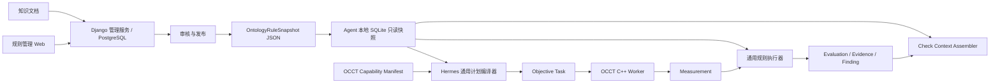

# DFM 本体、规则库与 Agent 运行快照设计

## 1. 设计目标

本设计只解决三类需要跨代码仓库、跨端共享并独立发布的问题：

1. 用稳定 ID 描述 DFM 的 Process、Feature Type、Region Type、Metric、Check 和 Factor；
2. 生成、审核、发布系统默认规则和企业规则；
3. 将当前企业可执行的本体与规则编译成 Agent 可离线使用的只读快照。

本体库不是几何算法数据库。OCCT 如何识别螺钉柱、如何计算壁厚、拔模角和圆角，仍由
`dfm-occt-worker` 的 C++ 实现和 Capability Manifest 负责。数据库只描述这些能力的业务语义、
组合关系和规则。

`V1.xlsx` 仍是人工业务整理材料，不是数据库模型，也不直接作为运行时输入。

## 2. 为什么这些数据需要落库

一个概念只有在至少满足下列一项时才进入本体/规则库：

- 需要由管理后台新增、修改、审核或停用；
- 需要系统默认、企业或客户不同版本；
- 需要 Web、Desktop、Agent 和 OCCT 使用统一稳定 ID；
- 需要在生成规则时明确提供给 AI；
- 需要版本追溯、引用来源或重放历史分析。

否则应留在代码中。例如壁厚射线算法、Shape Healing 策略和孔深计算实现不进入数据库。

仅把表建出来不会让 AI 自动理解本体。管理服务和 Agent 必须按 Check 组装有限上下文，明确提供
概念、关系、可用 Operand、Factor、规则和知识引用。

## 3. 三层数据架构



| 层级 | 数据源 | 职责 |
| --- | --- | --- |
| 算法能力层 | OCCT C++ 代码和 Capability Manifest | Recognizer、Calculator、Metric/Quantity、参数和认证状态 |
| 管理控制层 | Django/PostgreSQL | 本体维护、规则生成、审核、默认/企业覆盖、知识引用和发布 |
| Agent 运行层 | 本地 SQLite 快照 | 只读查询、Check 上下文、计划编译、规则选择和离线复现 |

管理库和 Agent 本地库不是同一个数据库。管理库支持编辑和继承；本地库是一次发布后展开、校验、
不可变的运行投影。

当前代码只实现了 Agent 运行层：随仓库提供的 Snapshot Schema 2 发布包会被安装为本地 SQLite。
Django/PostgreSQL 管理控制层、签名发布 API、企业继承和后台同步仍是待交付目标，不能因为存在
本地表结构就宣称规则管理平台已经完成。

多端不直接连接 PostgreSQL，通过管理服务共享字典：

```text
GET /v1/dfm/dictionary?ontology_version=...
GET /v1/dfm/checks/{check_id}/context
GET /v1/dfm/publications/latest?process=...&organization_id=...
GET /v1/dfm/publications/{snapshot_id}/artifact
```

Web 使用字典/Context API，Agent 下载签名发布物，OCCT 只交换 Capability 和几何任务契约。

## 4. 中心管理库表

第一期使用 9 张核心表，不建立完整 RDF/OWL 系统，也不为 Excel 的一级、二级、三级标题建表。

### 4.1 `dfm_concept`

所有跨端共享的稳定业务概念。

| 字段 | 类型 | 说明 |
| --- | --- | --- |
| `id` | uuid PK | 数据库主键 |
| `concept_id` | varchar(180) UNIQUE | 稳定 ID，如 `check.main_wall_minimum_thickness` |
| `concept_type` | varchar(30) | `process/feature_type/region_type/metric/check/factor` |
| `name_zh` | varchar(180) | 中文显示名 |
| `name_en` | varchar(180) nullable | 英文显示名 |
| `definition` | text | 无阈值的准确工程定义 |
| `aliases_json` | jsonb | 同义词和旧名称 |
| `data_schema_json` | jsonb nullable | Factor 值或 Metric 值的 JSON Schema |
| `properties_json` | jsonb | 不同 Concept Type 的受控扩展属性 |
| `owner_organization_id` | uuid nullable | 空为系统概念，非空为企业扩展 |
| `status` | varchar(20) | `draft/active/retired` |
| `created_by_id` | uuid | 创建人 |
| `updated_at` | timestamptz | 更新时间 |

`properties_json` 的常用字段：

| Concept Type | 字段 |
| --- | --- |
| Feature Type | `worker_kind` |
| Region Type | `worker_role` |
| Metric | `worker_metric_id/quantity_id/dimension/canonical_unit` |
| Factor | `runtime_key/default_value/question/source_policy` |
| Check | `default_severity/report_group` |

`concept_id` 发布后不得改名；改显示名称或定义不改变稳定 ID。确实发生语义不兼容时创建新 ID，旧 ID
进入 `retired`。

### 4.2 `dfm_relation`

保存本体关系，也是 Agent 通用编译和 AI 上下文的核心。

| 字段 | 类型 | 说明 |
| --- | --- | --- |
| `id` | uuid PK | 主键 |
| `relation_id` | varchar(220) UNIQUE | 稳定关系 ID |
| `subject_concept_id` | uuid FK | 主语 Concept |
| `predicate` | varchar(40) | 受控谓词 |
| `object_concept_id` | uuid FK | 宾语 Concept |
| `qualifiers_json` | jsonb | 关系的可执行限定信息 |
| `sort_order` | integer | Operand、询问和显示顺序 |
| `status` | varchar(20) | `draft/active/retired` |

第一期谓词：

| Predicate | 示例 | 是否参与执行 |
| --- | --- | --- |
| `HAS_CHECK` | Process → Check | 是 |
| `HAS_REGION` | Feature Type → Region Type | 是 |
| `APPLIES_TO_FEATURE` | Check → Feature Type | 是 |
| `APPLIES_TO_REGION` | Check → Region Type | 是；可按 Operand alias 指定目标区域 |
| `USES_OPERAND` | Check → Metric | 是 |
| `REQUIRES_FACTOR` | Process/Check → Factor | 是 |
| `AFFECTS` | Factor/Feature → Check | AI解释和检索 |
| `RELATED_TO` | 任意 Concept → Concept | AI解释和检索 |

`USES_OPERAND.qualifiers_json`：

```json
{
  "alias": "boss_wall_thickness",
  "aggregation": "minimum",
  "required": true
}
```

Metric 的 `worker_metric_id/quantity_id` 来自 Metric Concept；Feature 的 `worker_kind` 和 Region 的
`worker_role` 来自对应 Concept。Operand 的目标区域通过关系解析：

```text
Check ──APPLIES_TO_REGION──> Region <──HAS_REGION── Feature
  └─────APPLIES_TO_FEATURE───────────────────────────┘
```

同一 Check 只有一个区域时，`APPLIES_TO_REGION.qualifiers_json` 为 `{}`。多 Measurement 分别使用
不同区域时，在该关系中用 `operand_aliases` 明确映射，例如：

```json
{"operand_aliases": ["boss_wall_thickness"]}
```

发布器必须保证每个 Operand alias 最终只解析到一个 Region 和一个 Feature，禁止在
`USES_OPERAND` 中重复保存 `feature_kind/region_role/worker_metric_id/quantity_id`。

`REQUIRES_FACTOR.qualifiers_json`：

```json
{
  "usage_role": "rule_selector",
  "required": true,
  "missing_policy": "ask_user",
  "phase": "analysis",
  "question": "使用什么材料牌号？",
  "required_by": ["check.screw_boss.wall_ratio"]
}
```

### 4.3 `dfm_factor_option`

只保存枚举型 Factor 的系统或企业选项。

| 字段 | 类型 | 说明 |
| --- | --- | --- |
| `id` | uuid PK | 主键 |
| `factor_concept_id` | uuid FK | 必须指向 `concept_type=factor` |
| `organization_id` | uuid nullable | 空为系统选项 |
| `option_code` | varchar(100) | 稳定选项码，如 `ABS` |
| `name_zh` | varchar(160) | 显示名称 |
| `value_json` | jsonb | 实际规范值 |
| `sort_order` | integer | 排序 |
| `status` | varchar(20) | `active/retired` |

唯一约束按系统/企业作用域实现。Excel 的三级分类只用于后台显示，可放在 Concept 的
`properties_json.display_group`，不参与匹配。

### 4.4 `dfm_rule_version`

一行保存一条完整、不可变的规则版本。条件不拆成 `rule_condition` 表，因为 Agent 按 Check 获取
本次全部候选规则，管理后台也以完整决策行编辑和审核。

| 字段 | 类型 | 说明 |
| --- | --- | --- |
| `id` | uuid PK | `rule_version_id` |
| `rule_id` | varchar(180) | 稳定规则身份 |
| `version` | varchar(32) | 规则版本 |
| `check_concept_id` | uuid FK | 对应 Check |
| `owner_organization_id` | uuid nullable | 空为系统规则，非空为企业创建规则；实际生效范围仍由 Rule Set 决定 |
| `name` | varchar(180) | 规则名称 |
| `conditions_json` | jsonb | 多个 Factor 原子条件，全部 AND |
| `expression_json` | jsonb | 引用 Operand Alias 的受控表达式 |
| `comparator` | varchar(20) | `GT/GTE/LT/LTE/EQ/NE/BETWEEN` |
| `threshold_json` | jsonb | 常量、上下限或发布前已编译的查表结果 |
| `result_unit` | varchar(40) nullable | 表达式结果单位 |
| `severity` | varchar(20) | 不合格严重程度 |
| `recommendation_template` | text nullable | 工程建议模板 |
| `explanation_text` | text nullable | 人可读说明 |
| `priority` | integer | 同作用域优先级 |
| `is_default` | boolean | 无专用变体时的默认规则 |
| `status` | varchar(20) | `draft/review/approved/released/retired` |
| `generated_by_ai` | boolean | 是否由 AI 起草 |
| `content_sha256` | char(64) | 不可变内容哈希 |
| `created_by_id` | uuid | 创建人 |
| `reviewed_by_id` | uuid nullable | 审核人 |
| `reviewed_at` | timestamptz nullable | 审核时间 |

唯一约束：`UNIQUE(rule_id, version)`。

示例：

```json
{
  "conditions": [
    {"factor_id": "factor.material", "operator": "EQ", "value": "ABS"},
    {"factor_id": "factor.surface_texture", "operator": "IN", "value": ["MT11010", "MT11020"]}
  ],
  "expression": {
    "op": "divide",
    "args": [
      {"operand": "boss_wall_thickness"},
      {"operand": "adjacent_main_wall_thickness"}
    ]
  },
  "comparator": "BETWEEN",
  "threshold": {"lower": 0.4, "upper": 0.6},
  "result_unit": "ratio"
}
```

### 4.5 `dfm_rule_set`

保存系统、企业或客户的一次规则发布配置。

| 字段 | 类型 | 说明 |
| --- | --- | --- |
| `id` | uuid PK | 主键 |
| `rule_set_code` | varchar(140) | 稳定规则集编号 |
| `version` | varchar(32) | 版本 |
| `process_concept_id` | uuid FK | 制造工艺 |
| `scope_type` | varchar(20) | `system/organization/customer` |
| `organization_id` | uuid nullable | 企业范围 |
| `customer_id` | uuid nullable | 客户范围 |
| `base_rule_set_id` | uuid nullable | 固定继承的基础规则集版本 |
| `status` | varchar(20) | `draft/review/released/retired` |
| `content_sha256` | char(64) | 内容哈希 |
| `released_by_id` | uuid nullable | 发布人 |
| `released_at` | timestamptz nullable | 发布时间 |

### 4.6 `dfm_rule_set_item`

| 字段 | 类型 | 说明 |
| --- | --- | --- |
| `id` | uuid PK | 主键 |
| `rule_set_id` | uuid FK | 所属规则集 |
| `rule_version_id` | uuid FK nullable | 包含或覆盖的版本 |
| `action` | varchar(20) | `include/override/disable` |
| `target_rule_id` | varchar(180) nullable | 被覆盖/停用的稳定 Rule ID |
| `precedence` | integer | 展开顺序 |

管理服务发布时先展开 `base_rule_set_id`，生成唯一有效规则候选集合；Agent 本地不再重复处理多层继承。

### 4.7 `dfm_rule_citation`

| 字段 | 类型 | 说明 |
| --- | --- | --- |
| `id` | uuid PK | 主键 |
| `rule_version_id` | uuid FK | 规则版本 |
| `knowledge_chunk_ref` | varchar(220) | 知识模块提供的稳定片段身份；跨服务时是逻辑引用，不建立数据库 FK |
| `knowledge_revision` | varchar(80) | 被引用片段的不可变修订版本 |
| `support_type` | varchar(30) | `condition/threshold/explanation/recommendation` |
| `note` | text nullable | 审核说明 |

`knowledge_document/knowledge_chunk` 属于独立知识模块，不复制进本体库；Citation 必须同时固定片段
身份和 Revision。第一阶段知识模块可与 Django 管理服务同仓部署，但仍保持独立领域模型；在没有
实际检索、引用和审核消费者前，不单独拆一个微服务或代码仓库。

### 4.8 `dfm_rule_generation`

记录自然语言和知识库生成候选规则的全过程。AI输出仍必须落成 `dfm_rule_version(status=draft)`，
不能直接进入发布规则集。

| 字段 | 类型 | 说明 |
| --- | --- | --- |
| `id` | uuid PK | 生成任务 ID |
| `check_concept_id` | uuid FK | 目标 Check |
| `requested_by_id` | uuid FK | 发起人 |
| `input_text` | text | 用户的规则生成要求 |
| `ontology_publication_id` | uuid FK | AI看到的本体版本 |
| `knowledge_query_json` | jsonb | 检索条件和过滤范围 |
| `knowledge_chunk_refs_json` | jsonb | 实际提供的知识片段 ID/Revision |
| `model_id` | varchar(160) | 模型身份 |
| `prompt_version` | varchar(80) | 生成模板版本 |
| `output_json` | jsonb | AI原始结构化输出 |
| `validation_json` | jsonb | ID、Operand、Factor、单位和冲突校验结果 |
| `generated_rule_version_id` | uuid nullable | 通过结构校验后生成的 Draft |
| `status` | varchar(20) | `running/generated/rejected/error` |
| `created_at` | timestamptz | 创建时间 |

### 4.9 `dfm_publication`

记录中心库到 Agent 运行快照的发布结果。

| 字段 | 类型 | 说明 |
| --- | --- | --- |
| `id` | uuid PK | 发布 ID |
| `snapshot_id` | varchar(180) UNIQUE | 快照稳定身份 |
| `ontology_version` | varchar(32) | 本体版本 |
| `rule_set_id` | uuid FK | 已展开的规则集 |
| `scope_type/scope_key` | varchar | 运行作用域 |
| `schema_version` | integer | Snapshot Schema 版本；当前新发布固定为 `2` |
| `artifact_uri` | text | JSON/SQLite 发布物位置 |
| `content_sha256` | char(64) | 发布物哈希 |
| `status` | varchar(20) | `building/released/revoked` |
| `released_at` | timestamptz | 发布时间 |

发布校验必须证明：

- 所有关系引用存在且 Concept Type 合法；
- Check 的每个 Operand 能在目标 OCCT Capability 中解析出唯一 Metric/Quantity；
- 表达式只使用本 Check 声明的 Alias 和白名单运算；
- Factor 条件满足其数据 Schema 或枚举选项；
- 阈值与表达式结果单位兼容；
- 同优先级、同具体度规则不存在冲突；
- 每个关键工程阈值具有审核状态，要求引用时具有 Citation。

## 5. Agent 本地 SQLite

Agent 不复制管理库全部表，只安装一次发布后展开的运行投影：

```text
<HERMES_HOME>/workspace/dfm/ontology/dfm-ontology.sqlite3
```

当前实现位于 `tools/dfm/ontology/store.py`，数据库通过完整快照原子替换，不允许运行时逐行修改。

### 5.1 `snapshot_metadata`

保存 `snapshot_id`、数据库 Schema、Ontology Version、Rule Set Code/Version、Process、企业作用域、
发布时间和内容哈希。每个分析 Plan 固定记录 `scope_id/scope_version`，历史运行不受后续发布影响。

当前随仓库提供的默认身份是 `ontology.injection.default@1.1.0`。Schema 2 使用
`APPLIES_TO_REGION` 解析 Operand 目标；运行时仍能读取已经安装的 Schema 1 快照，但新发布物不得
继续使用 Schema 1 的重复 Selector 格式。

### 5.2 `ontology_concept`

中心 `dfm_concept` 的已发布投影，只包含当前作用域可见、执行或解释所需的概念。

### 5.3 `ontology_relation`

中心 `dfm_relation` 的已发布投影。Agent 用它完成：

- `Process → Check`：列出需要分析的 Check；
- `Check → Metric`：编译 Operand 和 Objective Operation；
- `Check → Factor`：澄清缺失信息并选择规则；
- `Check → Feature/Region`：把规则绑定到 Discovery 结果；
- `AFFECTS/RELATED_TO`：给 AI 提供解释关系。

### 5.4 `factor_option`

当前系统/企业有效选项的展开结果，供 Desktop/Web 表单和 AI 规则生成上下文使用。

### 5.5 `rule_version`

当前 Rule Set 展开后的候选规则版本。Agent 根据 Check 和确认 Factor 选择规则，编译为现有
`EffectiveRule + RuleBinding`，再由通用 Evaluation Engine 执行。

本地库不需要 `rule_set_item`、审批、用户或知识文档表；这些只属于管理控制层。

## 6. 本体如何真正被 AI 使用

Agent 提供有界的 Check Context，而不是把整个数据库或完整本体放进 Prompt：

```text
dfm_analysis(action="context", project_id=..., check_id=...)  # check_id 必填
```

返回：

```json
{
  "snapshot": {},
  "check": {},
  "relations": [
    {"predicate": "USES_OPERAND", "object": {}, "qualifiers": {}},
    {"predicate": "REQUIRES_FACTOR", "object": {}, "qualifiers": {}}
  ],
  "factor_options": [],
  "rules": []
}
```

它有三个消费者：

1. **规则生成 AI**：只可使用 Context 中声明的 Check、Operand、Factor、Option 和表达式 DSL，输出
   Draft Rule Version；
2. **分析 Agent**：知道为什么需要询问某项 Fact、当前执行哪些 Check；
3. **解释 AI**：结合已验证 Evaluation、概念定义、`AFFECTS/RELATED_TO` 和知识引用生成原因及整改说明。

AI 不直接查询任意 SQL，也不靠表名猜测含义。

## 7. 数据驱动的变更边界

### 7.1 新增规则

```text
新增/生成 Draft Rule
→ 校验 Operand、Factor、表达式和单位
→ 工程师审核
→ 加入 Rule Set
→ 发布新 Snapshot
→ Agent 原子更新本地 SQLite
→ 新 Plan 自动使用新 RuleBinding
```

Agent 代码不变。

### 7.2 新增特征区域和 Check

```text
OCCT 新增 Recognizer/Region/Metric Capability
＋ 本体新增 Feature/Region/Metric/Check/Relation
＋ 规则库新增 Rule Version
→ 发布阶段做 Capability × Ontology 交叉校验
→ Agent 通用编译器生成 Operation + RuleBinding
```

只要使用已有的数据契约、聚合方式、表达式 DSL 和证据模式，Agent 业务代码不变。

以下情况仍需改 Agent 通用基础设施：

- 新表达式运算符或新的单位维度；
- 无法用 Feature/Region Selector 表达的新关系解析方式；
- 新的 Fact 来源和 Resolver；
- 需要专用视觉表达的复合证据图；
- Objective/Discovery 契约发生不兼容变化。

## 8. Agent 运行工作流

```text
同步并固定 OntologyRuleSnapshot
→ 根据 Process 查询 HAS_CHECK
→ 根据 REQUIRES_FACTOR 发现缺失 Fact 并澄清
→ OCCT Discovery 返回 Feature/Region
→ 按 APPLIES_TO_FEATURE + APPLIES_TO_REGION + HAS_REGION + USES_OPERAND 编译 AnalysisPlan
→ OCCT 执行客观 Measurement
→ Agent 根据 conditions_json 选择唯一规则
→ 执行 expression_json + comparator + threshold_json
→ 生成 Evaluation
→ AI读取 Check Context + Evaluation 解释原因和建议
→ 程序使用 Measurement/Region 生成证据图
```

规则发布后修改只使 Evaluation、Evidence、Finding 和 Report 失效；输入、拓扑、Recognizer、
Calculator 或算法版本变化才使客观 Measurement 缓存失效。

## 9. 当前代码与迁移

已落地：

- `ontology_snapshot.schema.json`：Snapshot Schema 2 发布契约；
- `ontology_snapshot_v2.json`：注塑 `injection.default@1.1.0` 当前默认发布快照；
- `LocalOntologyStore`：JSON 发布包校验、SQLite 原子安装、只读查询；
- Check Context：按 Check 输出概念、关系、选项和规则；
- Ontology Compiler：把关系和规则编译为现有 `EffectiveRule/RuleBinding`；
- Discovery Target：优先使用已发布本体的 Feature/Region/Metric 关系；
- 注塑阈值不再来自旧静态阈值文件或项目参数。

当前算法 Capability 暂由 `geometry_capability_v1.json` 提供；生产接入 OCCT C++ 后改为读取经过认证的
`GET /v1/capabilities` 快照。`feature_catalog.json` 只保留未接通 OCCT 前的 Recognizer 占位信息，不再
作为正式 Check/Metric/Rule 数据源。

下一步：

1. Django 工程按第 4 节建立管理表、AI生成审计和发布器；
2. 发布器输出与 `ontology_snapshot.schema.json` 一致的签名 Artifact；
3. Agent 增加签名后台同步、版本选择、回滚和撤销列表；当前 Plan 固定 ID/哈希已经实现；
4. OCCT Capability 与本体发布做 CI 交叉校验；
5. 增加螺钉柱壁厚比例等多 Operand Golden Check 和专用复合证据 Renderer。
