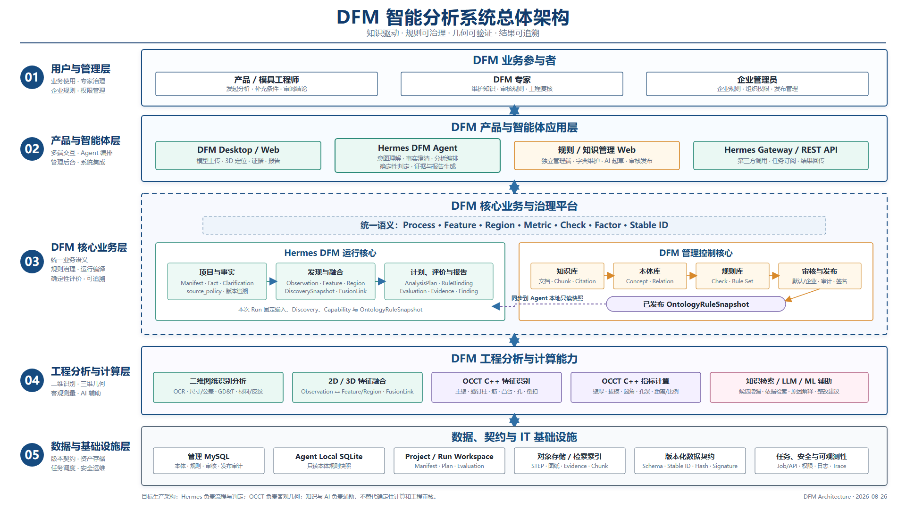
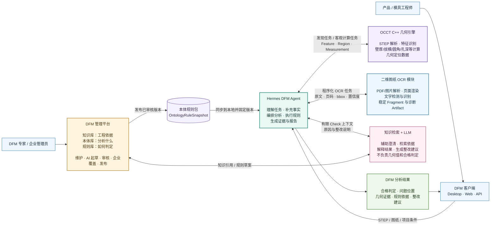
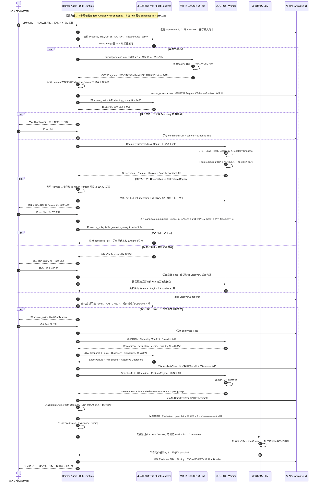

# DFM 分析系统总体架构与数据流

本文给出 DFM 产品的目标总体架构和单次分析数据流，覆盖 Hermes Agent、管理 Web、Django 管理服务、
知识库、本体库、规则库、二维识别/融合和独立 OCCT C++ Worker。完整字段仍以
`tools/dfm/schemas/`、`tools/dfm/contracts.py` 和
[DFM 本体、规则库与 Agent 运行快照设计](dfm-rule-catalog-database-design.md)为准。

图中实线边框表示 Hermes 当前已有实现或已冻结契约；虚线边框表示目标生产模块或后续能力。当前可运行
闭环使用 PythonOCC 参考 Worker，生产路径必须接入独立 `dfm-occt-worker`，且不得静默降级。

## 1. PPT 报告版分层架构图

[](assets/dfm-system-architecture-ppt.svg)

报告或 PPT 优先使用矢量文件：

- [下载 16:9 SVG 矢量图](assets/dfm-system-architecture-ppt.svg)：文字和线条缩放不失真，适合直接插入 PowerPoint；
- [下载 1920×1080 PNG](assets/dfm-system-architecture-ppt.png)：适合快速预览、普通文档和不支持 SVG 的系统。

该图按报告阅读顺序分为五层：用户与管理层、产品与智能体层、DFM 核心业务层、工程分析与计算层、
数据与基础设施层。中间核心层突出知识库、本体库、规则库和 Hermes 确定性运行核心，工程层独立展示
二维图纸识别、2D/3D Fusion、OCCT C++ 特征识别与指标计算。

## 2. 一图看懂 DFM 系统逻辑关系



这张图只表达七个核心关系：

1. 管理平台统一维护知识、本体和规则，并发布经过审核的本体规则包；
2. Hermes 固定本次使用的规则包，负责把用户、规则和计算流程串起来；
3. OCCT 只负责特征识别、指标计算和几何定位，不读取规则阈值；
4. 二维模块只做程序化 OCR；Hermes 当前会话大模型理解工程语义并提议 Observation/FusionLink，
   程序负责校验、落库和几何关系验证；
5. Hermes 的程序执行表达式和合格判定，不把 pass/fail 交给大模型；
6. 知识库和 LLM 用于规则起草、依据检索、结果解释及整改建议；
7. 客户端最终得到可定位、可追溯、可复现的 DFM 分析结果。

## 3. DFM 分析系统分层技术架构图

```mermaid
flowchart TB
    subgraph L4["04 用户与生态接入层"]
        direction LR
        U1["产品/模具工程师<br/>上传模型 · 补充事实 · 审阅结论"]
        U2["DFM 专家/企业管理员<br/>维护知识 · 审核规则 · 发布版本"]
        UI1["DFM Desktop / Web<br/>项目 · 三维定位 · 证据 · 报告"]
        UI2["规则管理 Web<br/>字典 · 本体 · 规则 · 知识 · 审核"]
        API["Gateway / REST API<br/>第三方 PLM/MES/业务系统"]
        U1 --> UI1
        U2 --> UI2
    end

    subgraph L3["03 核心应用与引擎层"]
        direction LR

        subgraph HR["纵向能力 A · Hermes DFM 运行面 · hermes-agent"]
            direction TB
            HA["Agent Core + DFM Skill/Toolset<br/>意图理解 · 工艺选择 · 工具编排"]
            HP["Project / Run Orchestrator<br/>Input · Manifest · Fact · Clarification"]
            HF["Fact Resolver<br/>source_policy · 冲突处理 · 用户确认"]
            HD["Discovery / Fusion Orchestrator<br/>Feature · Region · Observation · FusionLink"]
            HC["Ontology × Capability Compiler<br/>AnalysisPlan · RuleBinding · 版本固定"]
            HE["Deterministic Evaluation<br/>表达式 · 聚合 · 阈值比较"]
            HRP["Evidence / Finding / Report<br/>定位图 · JSON · MD · PPTX"]
            HA --> HP --> HF --> HD --> HC --> HE --> HRP
        end

        subgraph MC["纵向能力 B · 管理控制面 · 独立 Web + Django"]
            direction TB
            MA["Dictionary / Ontology Management<br/>Concept · Relation · Factor Option"]
            MR["Rule Lifecycle<br/>AI 起草 · 校验 · 审核 · 默认/企业规则"]
            MK["Knowledge Management<br/>Document · Revision · Chunk · Citation"]
            MP["Publication Service<br/>继承展开 · 冲突/单位/能力校验 · 签名发布"]
            MS["Snapshot / Dictionary API<br/>同步 · 固定版本 · 撤销 · 回滚"]
            MA --> MR --> MP --> MS
            MK --> MR
            MK --> MP
        end

        subgraph GC["纵向能力 C · 几何计算面 · dfm-occt-worker"]
            direction TB
            CAP["Capability Manifest<br/>Recognizer · Calculator · Metric · Quantity"]
            GD["STEP Load / Heal / Snapshot<br/>Topology · RenderMesh · TopologyMap"]
            GR["Feature/Region Recognition<br/>主壁 · 螺钉柱 · 筋 · 凸台 · 孔 · 倒扣 · 外观面"]
            GM["Objective Calculators<br/>壁厚 · 拔模 · 圆角 · 孔深 · 距离 · 比例"]
            GA["Geometry Artifacts<br/>Measurement · ScalarField · Scene · Map"]
            GD --> GR --> GM --> GA
            CAP --> GR
            CAP --> GM
        end

        subgraph DC["纵向能力 D · Hermes 内置二维图纸分析面"]
            direction TB
            DI["Programmatic Drawing OCR<br/>PDF/图片 · 页面渲染 · Fragment · bbox"]
            DO["Agent Drawing Interpretation<br/>复用当前 Hermes 模型 · Observation 提议"]
            DF["Hybrid 2D/3D Fusion<br/>Agent 提议 · 程序落库 · 几何验证"]
            DI --> DO --> DF
        end

        subgraph AX["纵向能力 E · AI 与识别辅助"]
            direction TB
            ML["ML Candidate Assistance<br/>候选分类 · 排序 · 置信度"]
            LLM["LLM Reasoning<br/>澄清交互 · 规则草案 · 原因/整改说明"]
        end
    end

    subgraph L2["02 数据与资产层"]
        direction LR
        AS["Agent Workspace<br/>project_manifest · DiscoverySnapshot<br/>Plan · Run · Evaluation"]
        LS["Agent Local Ontology SQLite<br/>只读 OntologyRuleSnapshot"]
        MYSQL["管理 MySQL<br/>本体 · 规则 · Rule Set · 审核 · 发布审计"]
        KS["知识资产<br/>原始文档/Revision · Chunk<br/>对象存储 + 检索索引"]
        GS["几何与报告资产<br/>STEP · Geometry/Topology/Render Snapshot<br/>Evidence · Report"]
    end

    subgraph L1["01 基础设施与集成层"]
        direction LR
        CT["版本化数据契约<br/>JSON Schema · Stable ID · SHA-256 · Signature"]
        JT["任务与传输<br/>Local CLI / REST Job API · Event · Retry/Timeout"]
        INF["数据基础设施<br/>MySQL · Object Storage · 可选独立向量检索服务"]
        CMP["计算资源<br/>OCCT Worker Pool · CPU/Memory/Concurrency"]
        MOD["模型服务<br/>LLM · Embedding · 可选视觉模型"]
        OBS["安全与运维<br/>租户隔离 · 权限 · 审计 · 指标 · 日志 · Trace"]
    end

    UI1 --> HA
    API --> HA
    UI2 --> MA
    UI2 --> MR
    UI2 --> MK

    MS -- "签名 OntologyRuleSnapshot" --> LS
    LS -- "Concept / Relation / Factor / Rule" --> HF
    LS -- "Check / Operand / Rule" --> HC
    LS -- "EffectiveRule" --> HE

    HD -- "GeometryDiscoveryTask" --> GD
    GR -- "Observation / Feature / Region" --> HD
    CAP -- "能力与版本" --> HC
    HC -- "ObjectiveTask" --> GM
    GA -- "客观几何结果" --> HE
    GA -- "Field / Scene / Map" --> HRP

    HD -- "DrawingOcrTask" --> DI
    DI -- "OCR Fragment Artifact" --> HD
    HD -- "drawing_context / fusion_context" --> DO
    DO -- "submit_observations" --> HF
    DO -- "FusionLink 提议" --> DF
    DF -- "程序校验后的 candidate / ambiguous" --> HD
    ML -.->|只增强候选，不单独确认几何事实| GR
    ML -.->|辅助 OCR/分类，不直接形成 confirmed Fact| DO
    MK -- "带 Revision 的 Citation" --> LLM
    HE -- "已验证 Evaluation" --> LLM
    LS -- "有界 Check Context" --> LLM
    LLM -- "解释与整改文本" --> HRP

    HP --> AS
    HF --> AS
    HD --> AS
    HC --> AS
    HE --> AS
    HRP --> GS
    GA --> GS
    MA --> MYSQL
    MR --> MYSQL
    MP --> MYSQL
    MK --> KS

    MYSQL --> INF
    KS --> INF
    GS --> INF
    MS --> CT
    HC --> CT
    CAP --> CT
    HD --> JT
    HC --> JT
    GD --> CMP
    GM --> CMP
    DO -.->|复用当前会话模型| LLM
    ML --> MOD
    LLM --> MOD
    HA --> OBS
    MS --> OBS
    GD --> OBS

    classDef access fill:#eef7ff,stroke:#6093bc,color:#172b3a,stroke-width:1.5px;
    classDef current fill:#eaf8f3,stroke:#2f8976,color:#17362f,stroke-width:1.6px;
    classDef target fill:#fff7e8,stroke:#b98632,color:#493715,stroke-width:1.5px,stroke-dasharray:6 4;
    classDef geometry fill:#f3efff,stroke:#7558aa,color:#2f2446,stroke-width:1.5px,stroke-dasharray:6 4;
    classDef drawing fill:#edf7ff,stroke:#397f9f,color:#193645,stroke-width:1.5px,stroke-dasharray:6 4;
    classDef assist fill:#fff0f5,stroke:#b36183,color:#4a2434,stroke-width:1.5px,stroke-dasharray:6 4;
    classDef store fill:#f5f2ff,stroke:#8070ad,color:#302a43,stroke-width:1.4px;
    classDef infra fill:#f2f5f7,stroke:#77838d,color:#25313a,stroke-width:1.2px;

    class U1,U2,UI1,UI2,API access;
    class HA,HP,HF,HD,HC,HE,HRP current;
    class MA,MR,MK,MP,MS target;
    class CAP,GD,GR,GM,GA geometry;
    class DI,DO,DF current;
    class ML,LLM assist;
    class AS,LS,MYSQL,KS,GS store;
    class CT,JT,INF,CMP,MOD,OBS infra;
```



架构边界：

- **Hermes 负责分析语义和流程**：项目事实、澄清、快照固定、计划编译、确定性判定、证据和报告。
- **OCCT 负责客观几何**：不读取规则阈值，不决定 pass/fail，不生成严重程度和整改建议。
- **二维图纸模块只负责 OCR 证据**：输出带稳定 Fragment ID、页码、bbox、原文、置信度和版本的
  Artifact；当前 Hermes 会话大模型在 Agent event loop 内提议 Observation 和 FusionLink，程序校验
  来源 ID、Revision 与数据契约后落库，再由几何关系/拓扑验证确定 `candidate` 或 `ambiguous`。
- **管理服务负责可治理数据**：系统默认/企业本体和规则、知识引用、审核、发布、撤销与回滚。
- **知识库和 AI 只辅助**：知识用于规则起草与结果解释；AI 不替代几何计算和确定性规则执行。
- **管理库与运行库隔离**：本体库和规则库使用中心 MySQL；Agent 只安装发布后展开的只读快照，
  不直接连接中心 MySQL。

## 4. DFM 分析数据流泳道图



单次分析的主数据链为：

```text
InputRecord + DrawingOcrFragment + AgentObservation + confirmed Fact + OntologyRuleSnapshot
→ GeometryDiscoveryTask
→ Observation / Feature / Region / FusionLink / GeometrySnapshot
→ DiscoverySnapshot
→ AnalysisPlan / RuleBinding / ObjectiveTask
→ Measurement / ScalarField / RenderScene / TopologyMap
→ Evaluation / FailedPatch
→ Evidence / Finding / Report
```

## 5. 关键版本与失效原则

| 变化 | 可复用数据 | 必须重新生成 |
| --- | --- | --- |
| 只修改规则或规则集 | Input、Discovery、Measurement、几何 Artifact | Evaluation、Evidence、Finding、Report |
| 修改材料、皮纹等规则 Fact | Input、通常可复用 Discovery 和 Measurement | Plan、Evaluation、Evidence、Finding、Report |
| 修改出模方向等几何 Fact | Input、方向无关的中间结果 | 受影响 Discovery、Plan、Measurement 及下游结果 |
| 修改 STEP 或 OCCT/算法版本 | 无法跨 Snapshot 复用拓扑身份 | Discovery、Plan、Measurement 和全部下游结果 |
| 仅修改知识文档或解释模板 | 已验证 Evaluation 和几何证据 | AI 解释文本及相应报告版本 |

所有 Feature、Region、Measurement、Evidence 都必须回链输入哈希、Topology/Render Snapshot、Provider
版本和规则快照。Face 序号、三角形索引或内存 Shape Handle 不得跨 Snapshot 复用。

## 6. 当前实现与目标生产状态

| 范围 | 当前状态 | 目标状态 |
| --- | --- | --- |
| Hermes DFM 运行面 | Manifest、澄清、Discovery 骨架、本地 SQLite、计划、Evaluation、Evidence、报告已有参考闭环 | 接入正式发布和外部 Worker，完善 Fact Resolver、多端产品体验和生产 E2E |
| 本体/规则库 | 仓库内 Snapshot Schema 2 + Agent 本地只读 SQLite | Django 中心管理、默认/企业继承、审核、签名发布、同步/撤销/回滚 |
| 知识库 | 数据模型和 Citation 边界已设计，尚未形成生产模块 | 文档版本、Chunk、检索、固定 Citation，服务规则起草和分析解释 |
| 三维几何 | PythonOCC 参考实现；普通全模型区域和少量参考指标 | 独立 OCCT C++ Worker 完成生产级特征识别、区域计算和几何证据 Artifact |
| 2D/Fusion | 程序化 PDF/图片 OCR；Hermes Agent 提议、程序校验落库、几何验证的 Observation/FusionLink 基础闭环 | 完善尺寸/公差/GD&T、视图与引线识别、投影空间匹配和工程审核体验 |
| AI | 默认复用 Hermes 当前会话模型完成有界 OCR 语义和融合判断，无独立 DFM 模型路由 | 使用有界 Check Context 与带版本知识引用；始终不负责客观几何数值和最终规则判定 |
