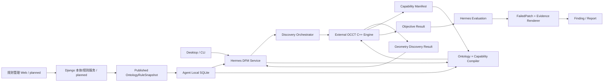
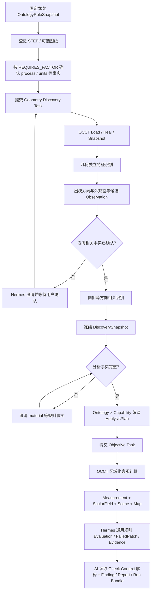

# DFM 架构、工作流与 OCCT C++ 契约

本文是 DFM 智能体与独立几何引擎项目的研发协作入口。它说明模块边界、两阶段运行流程、
OCCT C++ 交付要求和关键数据契约。完整字段以 `tools/dfm/schemas/` 和
`tools/dfm/contracts.py` 为准。

## 1. 已批准技术方向

- 生产级三维特征识别和客观指标计算由**独立 OCCT C++ 项目**实现；
- 规划中的 Django 管理服务负责 DFM 本体、规则生成/审核、默认/企业规则集和发布；当前尚未交付；
- Hermes 安装已发布的本体/规则只读快照，负责项目、事实、澄清、通用计划编译、规则执行、
  评价、证据、Finding 和报告；
- PythonOCC 与 NX 已从当前执行、回归和降级链路移除；几何执行只能使用显式探测通过的外部 Engine；
- 神经网络可用于候选生成、分类和排序，但几何事实必须由确定性几何算法验证；
- NX/Parasolid 路线延期，不属于当前 STEP 生产闭环的前置条件；
- 各工程只通过版本化 Snapshot、JSON Schema、Artifact 和 Job 协议集成，不共享内部对象或数据库。

## 2. 架构边界



| 模块 | 负责 | 不负责 |
| --- | --- | --- |
| 管理 Web/Django | Concept/Relation、规则生成与审核、默认/企业覆盖、知识引用、发布 | 几何计算、生产 Run |
| Hermes | 本地只读快照、Manifest、事实、澄清、DiscoverySnapshot、通用 AnalysisPlan、规则执行、Evaluation、Evidence、Finding、报告 | CAD 内核算法、在线编辑正式规则、伪造特征或几何值 |
| OCCT C++ Engine | STEP Loader、Shape Healing、Topology/Render Snapshot、特征候选、Feature/Region、客观 Calculator、Artifact | 用户事实确认、规则阈值、pass/fail、严重程度、建议和报告 |
| ML 辅助模块 | 对候选 Feature/Region 分类、排序或给出置信度 | 单独产生最终几何事实或绕过几何验证 |
| 外部 Engine Adapter | 探测并调用版本固定的 Analysis Situs/OCCT CLI，校验 JSONL、Artifact 和哈希 | 规则阈值、Evaluation、静默降级 |
| 知识模块 | 文档版本、Chunk、检索与 Citation；辅助规则起草和解释 | 几何计算、直接发布阈值、替代规则审核 |

独立 C++ 项目可以部署为本地 Worker 或远程服务，但必须消费和产生同一份契约。Hermes 不应
链接 C++ 项目的内部库，也不应依赖 OCCT 对象、内存地址或进程内 Shape Handle。

当前 Hermes 实际运行链路是“随仓库 Snapshot Schema 2 → 本地 SQLite → ordinary 全模型
Discovery fallback → 外部 Analysis Situs/OCCT 实验级 Objective → Hermes
Evaluation/Evidence/Report”。图中的外部 Geometry Discovery/Recognizer 和 Django 发布仍是目标
链路；外部 Objective 已接通，但不能把实验级 Calculator 或 ordinary fallback 表述为生产认证。

本体只描述稳定业务语义和关系，不保存算法实现。发布器必须验证本体中的 `worker_kind`、
`worker_role`、`worker_metric_id` 和 `quantity_id` 能在目标 OCCT Capability 中解析；验证失败的
Check 不得发布为可执行能力。完整库表见
[DFM 本体、规则库与 Agent 运行快照设计](../dfm-rule-catalog-database-design.md)。

### 2.1 代码仓库归属

| 代码仓库 | 建议技术栈 | 主要职责 | 当前状态 |
| --- | --- | --- | --- |
| `hermes-agent` | Python；Desktop 为 Electron/React/TypeScript | Agent、DFM toolset/skill、项目与 Run、本地 Snapshot、通用编译/Evaluation/Evidence/Report、Desktop 交互 | 已接通实验级外部 Objective |
| 后台管理 Web（独立仓库） | 以现有前端栈为准，建议 React/TypeScript | 本体字典、规则编辑/生成、审核、发布、企业覆盖和审计 UI | 待实施 |
| DFM 管理服务（独立 Django 仓库） | Django/DRF、MySQL 8.0+；异步任务按实际消费者引入 | 九张中心表、知识 Citation、规则审核、Snapshot Schema 2 发布 API | 待实施 |
| `dfm-occt-worker` | C++17/20、OCCT、CMake/CTest | STEP、Snapshot、Recognizer、Calculator、几何 Artifact、Capability/Job API | 待实施 |
| 知识模块 | 首期作为 Django 仓库内独立领域模块；对象存储与向量检索按需要接入 | 原始文档、Revision、Chunk、检索和 Citation | 待实施；暂不拆独立仓库 |

管理 Web 不直接连接 MySQL；Hermes 不直接编辑中心规则；OCCT Worker 不访问规则库。知识模块
只有在规则起草和解释时通过带版本 Citation 的有限上下文介入，不进入几何 Objective，也不直接
决定 pass/fail。

## 3. 运行工作流

### 3.1 完整流程



### 3.2 为什么发现和计算分为两个契约

特征识别决定 Feature/Region，Feature/Region 又决定规则绑定和 Calculator 的执行区域。因此
不能先编译完整 AnalysisPlan 再让 Backend 随意发现特征。正式顺序必须是：

```text
GeometryDiscoveryTask
→ GeometryDiscoveryResult
→ Hermes 冻结 DiscoverySnapshot
→ Hermes 编译 AnalysisPlan
→ ObjectiveTask
→ ObjectiveResult
```

出模方向是特殊情况。引擎可以先产生一个或多个候选方向 Observation，但候选不得直接写成
confirmed Fact。需要方向的 Recognizer 返回 `blocked + missing_fact_names`，Hermes 在用户确认后
重新执行受影响的发现闭包。修改 `pull_dir` 会使方向相关 Feature/Region 和后续 Objective 缓存
失效，但不必重复与方向无关的输入登记和文档提取。

### 3.3 ordinary 补集

真实 Feature Region 必须解析为同一 TopologySnapshot 下的不可变 Face 引用。对某个 Metric，
ordinary Region 是所有已经批准、并参与该 Metric 的特征 Face 的补集。任何 Face 不得在同一
Metric 下漏算或由两个 Region 重复认领。低置信度或未实现 Recognizer 不生成伪 Feature；相应
区域继续留在 ordinary，或者显式阻塞需要该语义的专用规则。

### 3.4 二维图纸与 2D/3D Fusion 边界

当前 `drawing` 和 `fusion` Analyzer 只是显式占位，不能产生生产结论。后续二维输入先输出带
页码、bbox、原文、单位、置信度和 Provider 版本的 Observation；材料、公差、皮纹等高置信度信息
经过冲突检查后成为 Fact，歧义项进入 Clarification。2D Observation 与 3D Feature/Region 之间
通过可审核 `FusionLink` 关联，不把像素位置直接当成 CAD GeometryRef，也不允许图纸文本替代
三维客观测量。二维实现可后置，但 Observation/FusionLink 必须沿用现有 Manifest 数据链。

## 4. 核心数据链

```text
InputRecord
→ OntologyRuleSnapshot
→ GeometryDiscoveryTaskRequest
→ GeometryDiscoveryResultManifest
→ Observation / FeatureRecord / RegionRecord
→ DiscoverySnapshotRecord
→ RuleBinding + PlanOperation
→ ObjectiveTaskRequest
→ Measurement + ScalarField + RenderScene + TopologyMap
→ EvaluationRecord
→ FailedPatch
→ EvidenceRecord
→ FindingRecord / Report
```

| 对象 | 必须回链 |
| --- | --- |
| OntologyRuleSnapshot | Ontology Version、Rule Set、企业作用域、发布时间和内容哈希 |
| Observation | Input、候选值、置信度、Provider/模型/算法版本和来源 |
| Feature | Input SHA256、Recognizer、版本、Region 和置信度 |
| Region | Input SHA256、Feature；拓扑区域还要回链 TopologySnapshot/Entity |
| DiscoverySnapshot | Input、确认事实、Provider 版本、Feature/Region/Observation、Geometry/Topology/Render 快照引用、Artifact 引用和内容哈希 |
| Operation | Feature、Region、Metric、Quantity、Calculator 和参数来源 |
| Measurement | Operation、Metric、Quantity、Feature、Region、Field、输入和实现版本 |
| RuleOperand | Alias、Operation、Metric、Quantity、Aggregation、Feature 和 Region |
| RuleBinding | Check、Rule、主 Operand、附加 Operands、受控表达式和比较操作符 |
| Evaluation | Check、Rule、表达式、全部 Operand 值、全部 Measurement、实际值/单位和结果 |
| ScalarField | Operation、Scene、TopologyMap、两个 Snapshot、Sample/Cell |
| Evidence | Evaluation/FailedPatch、两个 Snapshot、相机、Renderer 和图片 Artifact |
| Finding | Check、Rule、Evaluation、Measurement、Feature、Region 和 Evidence |

### 4.1 多 Measurement 规则

一个业务 Check 可以引用多个客观 Measurement。例如螺钉柱柱壁厚规则同时引用：

```text
boss_wall_thickness
adjacent_main_wall_thickness
```

`RuleBinding` 保留一个主 Operand，并通过 `additional_operands` 声明其他具名 Operand；每个 Operand
独立声明 Operation、Metric、Quantity、Feature/Region 过滤和聚合方式。`expression` 使用受控 JSON
DSL，例如：

```json
{
  "op": "divide",
  "args": [
    {"operand": "boss_wall_thickness"},
    {"operand": "adjacent_main_wall_thickness"}
  ]
}
```

Hermes Evaluation Engine v2 必须：

1. 唯一解析或按声明方式聚合每个 Operand；
2. 拒绝缺失/歧义 Operand、跨输入 Measurement、单位冲突、非有限数值和除零；
3. 仅执行白名单运算，不执行 Python、SQL 或模型生成代码；
4. 将所有 Measurement ID、Operand 值、表达式、`check_id` 和 Rule Hash 写入 Evaluation；
5. 先计算一次表达式结果，再使用 `>=/<=/>/</==/!=/between` 做一次确定性判断。

`metric_id` 表示 OCCT 测量的客观几何量；`check_id` 表示 DFM 要判断的业务问题。一个 Metric 可以被
多个 Check 复用，一个 Check 也可以绑定多个 Metric/Quantity。外部 Objective Schema 当前保持版本 2，
因为表达式只属于 Hermes 的 RuleBinding/Evaluation，不进入 OCCT 请求或结果协议。

Check、Operand 和 Factor 不再由注塑适配器逐项硬编码。Agent 从本地本体关系
`HAS_CHECK/APPLIES_TO_FEATURE/APPLIES_TO_REGION/HAS_REGION/USES_OPERAND/REQUIRES_FACTOR`
编译现有契约。Feature/Region/Metric 的 Worker 标识从 Concept 属性取得，`USES_OPERAND` 不再
重复保存这些标识。AI需要理解某个 Check
时，通过 `dfm_analysis(action="context", check_id=...)` 获取该 Check 的有限语义子图和候选规则，
不直接读取数据库或把完整本体放入 Prompt。

复合表达式不能沿用单指标 ScalarField 的逐点阈值着色。第一阶段保留全部 Operand Region 和
Measurement 的可追溯 Finding；后续由专用复合证据 Renderer 同时展示各 Operand 区域。

## 5. Geometry Discovery Schema 1

### 5.1 请求

`GeometryDiscoveryTaskRequest` 是 Backend-neutral 请求，主要字段为：

| 字段 | 含义 |
| --- | --- |
| `schema_version` | 固定为 `1` |
| `request_id` | 本次发现请求的稳定身份 |
| `input_id` / `input_sha256` / `input_format` | 输入身份；当前生产范围为 STEP |
| `process` | 用户选择并确认的制造工艺 |
| `recognizer_ids` | 本次请求的白名单 Recognizer |
| `facts` | 已确认且 Recognizer 声明需要的事实，必须带 `source_ref` |

请求中禁止出现材料规则阈值、pass/fail、截图策略、严重程度和整改建议。未确认的候选方向不
得放进 `facts`。

### 5.2 结果

`GeometryDiscoveryResultManifest` 固定输出：

- 输入、process、request 和 producer 身份；
- `geometry_snapshot_ref`、`topology_snapshot_id`、`render_mesh_snapshot_id`；
- `ObservationRecord[]`、`FeatureRecord[]`、`RegionRecord[]`；
- 每个 Recognizer 的 `completed | blocked | not_implemented | failed` 状态；
- `geometry_snapshot`、`topology_map`、`render_scene` Artifact；
- 算法诊断，但不包含规则判断。

每个 `blocked` Recognizer 必须给出 `missing_fact_names`。神经网络参与时，Observation 或
Feature 的 provenance/properties 必须记录模型 ID、模型版本、输入表示和置信度；最终 Region
仍必须通过 TopologySnapshot 下的 GeometryRef 定位。

## 6. 当前外部 Objective Schema 2

`ObjectiveTaskRequest` 只在 DiscoverySnapshot 冻结后产生，包含：

- `run_id`、输入 SHA256 和格式；
- process/scope 身份；
- 使用稳定 `operation_id`/`calculator_id` 的 Operations；Hermes 内部的 Feature/Region/Fact 依赖不泄漏到 Engine；
- 已解析且带 `source_ref` 的几何参数。

成功结果为 `ObjectiveResultManifest`，并固定登记 `preflight.json`、`topology.json`、
`render_mesh.json`、`features.json`、`measurements.json`、`metric_fields.json` 与 `engine_result.json`。Backend 不返回
Evaluation、FailedPatch、Evidence、severity、rule 或 recommendation。

当前本地 CLI 使用 Objective Schema 2 和 `dfm.geometry.request/event/result/v1`。只有数据语义发生
不兼容变化并由 Hermes 与 Engine 原子升级时才修改版本，不能把未来 Discovery/Region 契约的
版本 4 直接套到现有可执行文件。
只有数据语义本身发生不兼容变化才升级版本。

## 7. Snapshot 与拓扑身份

Face 序号只允许在一次 TopologySnapshot 内使用，不能跨 Loader、算法版本或重新加载复用：

```json
{
  "kind": "face",
  "index": 17,
  "entity_id": "face_000017",
  "input_sha256": "...",
  "topology_snapshot_id": "topology_..."
}
```

Discovery 必须持久化 GeometrySnapshot，并由后续 Objective 任务复用或验证。禁止重新读取 STEP
后按 Face 序号猜测 Region。若外部引擎确实需要重载，必须证明 Loader/Healing/Indexer 版本和
拓扑内容哈希一致，否则原 DiscoverySnapshot 失效并重新发现。

`TopologyMap` 必须来自生成 `RenderScene` 的同一次离散化，并将 GeometryRef 映射到
`primitive_id + triangle_id + render_mesh_snapshot_id`。Hermes 只绘制 Backend 返回的 Scene，
不重新打开 CAD。

## 8. Capability 契约

`GeometryBackendCapability` Schema 1 必须声明：

- `backend_id`、Backend/OCCT/Loader/Indexer 实现版本；
- 每个输入格式的 `certified | experimental | not_implemented | unhealthy`；
- 每个 Recognizer 的 Discovery Contract 版本、所需事实、输出 Observation/Feature/Region 和认证哈希；
- 每个 Calculator 的 Objective Contract 版本、参数、Quantity、Artifact、Region mode 和认证哈希；
- 运行限制，如最大输入、并发、内存预算和内部线程配置。

Hermes 只能把 `certified` 能力用于生产 Plan。`experimental` 可用于研发和 Golden Model，不能
在报告中冒充生产结论。认证按“格式 × Recognizer/Calculator × 实现版本”分别进行。

## 9. 独立 OCCT C++ 项目建议结构

```text
dfm-geometry/
├── CMakeLists.txt
├── include/dfm_contract/
├── src/
│   ├── io/                 # STEP、单位、Healing、GeometrySnapshot
│   ├── topology/           # Index、Adjacency、TopologyMap
│   ├── recognition/        # pull candidate、wall、boss、rib、hole、undercut...
│   ├── calculators/        # thickness、draft、radius、depth...
│   ├── artifacts/          # field、scene、map、manifest
│   └── runtime/            # job、progress、cancel、resource budget
├── schemas/                # 从 Hermes 契约发布物同步，不手写分叉版本
├── fixtures/               # 两仓共享 Golden Contract Fixture
└── tests/
```

建议先提供 CLI Worker 便于本地 E2E，再使用相同 Handler 封装 HTTP 服务。无论传输方式如何，
输入输出和错误语义必须一致。

## 10. Job 与传输

远程部署建议保留稳定的通用 API：

```text
GET  /v1/capabilities
POST /v1/inputs
PUT  /v1/inputs/{input_id}/content
POST /v1/jobs                         # job_type=discovery|objective
GET  /v1/jobs/{job_id}
POST /v1/jobs/{job_id}/cancel
GET  /v1/jobs/{job_id}/result
GET  /v1/jobs/{job_id}/artifacts/{artifact_id}
```

服务端不接受 Hermes 本地文件路径。输入先登记 SHA256、大小、文件名和格式，需要时再上传。
Result 原子发布；Artifact 下载后由 Hermes 再次校验大小和 SHA256。

## 11. 并发、缓存和错误

- 每个 Job 使用隔离工作目录；进程级隔离是默认故障边界；
- OCCT 内部并行只能用于明确可重入的算法，并限制每个 Job 的线程数，避免多 Job 过度订阅；
- 调度必须同时考虑并发数、模型复杂度、预计 Mesh 大小、内存和临时磁盘；
- 缓存指纹包含输入、Geometry/Topology/Render Snapshot、Backend/算法版本、参数和 Region；
- 修改规则可复用 Measurement，但必须重做 Evaluation、Evidence、Finding 和报告；
- 一次 Run 固定 Ontology/Rule Snapshot；运行中不得切换发布版本；
- 修改输入、Healing、Topology、Mesh、Recognizer 或 Calculator 版本会使相关缓存失效；
- 公共错误归一为 `objective_input_invalid`、`objective_backend_unavailable`、
  `objective_calculation_failed`、`objective_result_invalid`、`objective_artifact_invalid` 和
  `run_cancelled`；Discovery 额外保留逐 Recognizer 的 blocked/not_implemented/failed 状态；
- OCCT C++ 不可用或失败时明确阻塞，不存在备用几何后端。

## 12. 验收要求

1. 两仓共用正式 Schema 和 Fixture，C++/Python 分别做读写与负例测试；
2. 合成模型验证可解析真值，真实脱敏产品验证工程语义，对抗模型验证失败边界；
3. Feature/Region 验收语义、拓扑覆盖率、重叠率、误报和漏报；
4. Calculator 验收单位、数值容差、控制极值召回、局部场和证据定位；
5. 重复运行验证 ID、哈希、排序和结果确定性；
6. 1/2/4/8 等并发阶梯验证吞吐、峰值内存、超时、取消、崩溃和长期泄漏；
7. 跨输入、跨 Snapshot、错误 Entity/Triangle 和 Artifact 哈希必须被拒绝；
8. 真实 OCCT C++ E2E 和模具工程师签字不可由模拟 Adapter 替代。

## 13. 当前代码入口

- Discovery 契约：`tools/dfm/contracts.py`、`geometry_discovery_*.schema.json`
- Backend Capability：`tools/dfm/backends/contracts.py`、`geometry_backend_capability.schema.json`
- Feature/Region：`tools/dfm/schemas/feature.schema.json`、`region.schema.json`
- Objective 契约：`objective_task.schema.json`、`objective_result_manifest.schema.json`
- Geometry/Evidence：`scalar_field.schema.json`、`render_scene.schema.json`、
  `topology_map.schema.json`、`evidence_*.schema.json`
- 本体/规则发布契约：`tools/dfm/schemas/ontology_snapshot.schema.json`（当前 Schema 2）
- Agent 本地本体运行时：`tools/dfm/ontology/store.py`
- 当前注塑发布快照：`tools/dfm/scopes/injection/ontology_snapshot_v2.json`
  （`ontology.injection.default@1.1.0`）
- 当前几何能力声明：`tools/dfm/scopes/injection/geometry_capability_v1.json`
- 特征目录：`tools/dfm/scopes/injection/feature_catalog.json`
- OCCT C++ Provider 边界：`tools/dfm/feature_recognition/occt_cpp.py`
- OCCT C++ Adapter：`tools/dfm/analyzers/occt.py`

开发阶段和优先级见 [DFM 开发路径](2026-07-13-dfm-hermes-agent-development-roadmap.md)。
